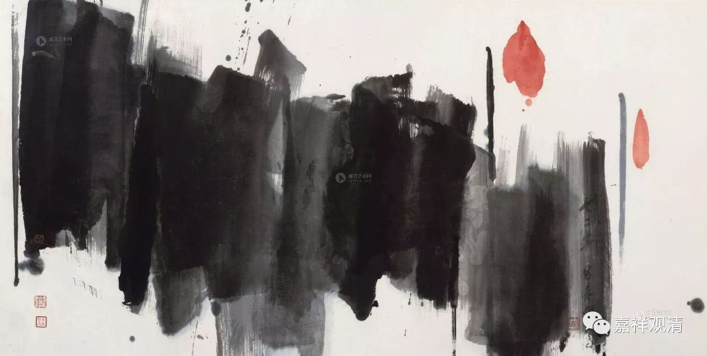

**《六门教授习定论》032（四）**

正知而住，这有点像禅宗里的说法，无论你做什么事情，都要对所做的事情非常清楚。比如禅宗里说“念念皆禅”，做哪件事情的时候心都不能离开，在这个背景之下才能谈禅宗的功夫，这都还是禅定的基础。

有一位已经对外开演禅法的年轻禅师，有一次，他去另一位大师处拜访。临告别时，大师问年轻的禅师：“请问您刚才进门时，伞是放在左手边还是右手边？”年轻的禅师被问愣住了，他完全记不起刚才的这一幕，这意味着，他没有能够时时照顾自己的身心……于是他遣散弟子，继续在大师门下学习，直到他能够做到，随时随地，“念念皆禅”——正念正知。

禅宗说，修行是什么？修行就是穿衣吃饭！吃饭、穿衣是一样的，不是什么“食不知味”啊等等，吃什么都是老老实实地吃——吃饭就是吃饭，做事就是做事。一般人则是：吃饭的时候想工作，工作的时候想娱乐，娱乐的时候想饭局……总没做在点上。

正知而住：去到谁家，也要知道。我们应该知道有些地方和尚是不能去的，是吧？坐也知道坐，站也知道站。

睡觉的因缘，我们来讲一讲吧。“又于热分极炎暑时，勇猛策励，发勤精进，随作一种所应作事。”在天比较热的时候，你还在做事情，然后呢，“劳倦因缘，遂于非时发起昏睡。”凡是不在夜间中分的时候，都不是睡觉的时候。本来呢，非时是不允许睡觉的，但是天比较热，也是一种特殊的情况。可以休息一下。

“为此义故，”这个时候呢，“暂应寝息……”是可以睡一会儿的。其实在戒律里面你们也可以看到，和尚其实下午睡觉的也有，就在经典里面，在戒律里面是有的。你们应该可能看到和尚有在房间里睡午觉的。

