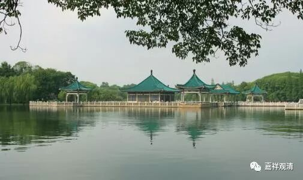

**远离四种执着**

** **

** 若执着此生，则非修行者；**

** 若执着世间，则无出离心；**

** 执着己目的，则无菩提心；**

** 执着心生起，则失正见地。**

** “远离四种执着”修心法开示**

 萨迦·班智达·贡噶·嘉晨

敬礼上师足

一般说来，一个已得人身并具备了各种条件，又遇到珍贵的佛法，且具有真实信心的人，应该正确地实修神圣的佛法，并应修“远离四种执着”法，如果您问这个教法是什么？答案是：不执着此生；不执着三界；不执着自己个人的目的；不执着实质性和性质性。

若加以解释，是这样的：执于此生是不值得的，因为人生如水泡，死期不可知。三界世间如毒果，纵然目前食之味美，却伴着未来的灾祸。任何执着它们的人必会迷惑。若人执着于自己的目的，则有如珍爱敌人之子，虽然目前甚令人喜悦，终必对自己造成伤害，所以，若人执于自己的目的，虽能得暂时的快乐，最后必会堕入恶道。若人执着于实质性（即具有功能者，如瓶子或柱子等）和性质性（即“此为实有”、“它是空的”、“它是全无边的”等等），则如在海市蜃楼中捉水一般，虽然目前看似有水，却不能喝而解渴，这个世间虽然存在于迷惑者的心中（虽然对于迷惑的心而言，这个世间好象是存在着），然而透过智慧的观察，却无法找到任何本质存在。因此，即已了解不要将心住于过去和未来，亦莫将心识住于现在，当知一切法皆远离所有心造的“边”。

故不执着于此生，则不堕于恶道，

不执着三界，则不生于世间，

不执着于自己的目的，则不生为声闻或缘觉，

不执着实质性和性质性，则能急速成就圆满究竟觉。

（上面就是“远离四种执着”的无误开示，由萨迦班智达依大吉祥萨迦巴（贡噶·宁波）的原意而造。）

