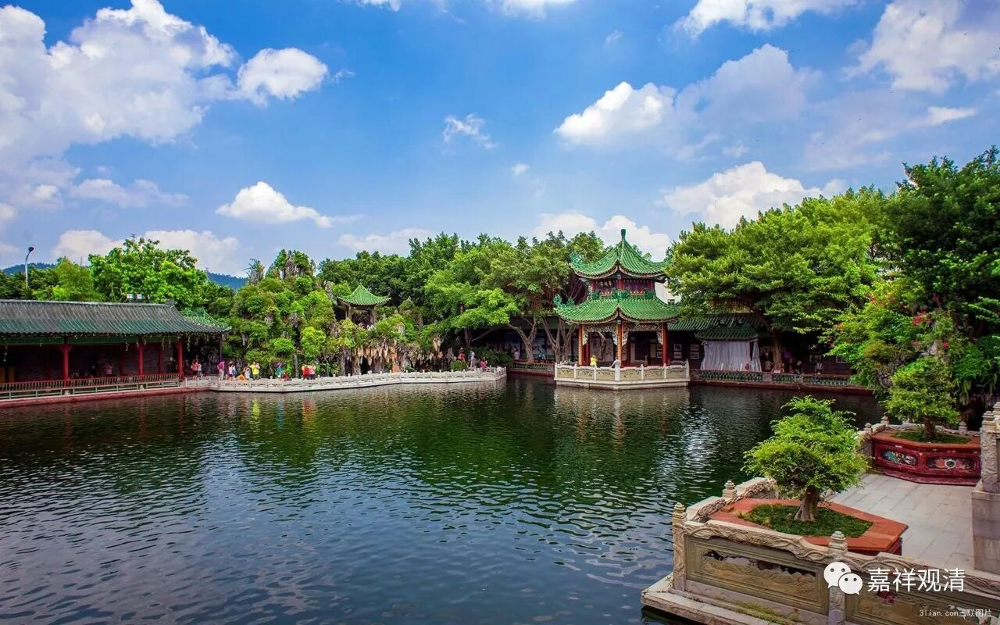

**《菩提速道》讲记001**

** **

诸佛正法贤圣三宝尊，从今直至菩提永皈依，

我以所修施等诸资粮，为利有情故愿大觉成。

《般若波罗蜜多心经》

观自在菩萨，行深般若波罗蜜多时，照见五蕴皆空，度一切苦厄。舍利子，色不异空，空不异色，色即是空，空即是色，受想行识亦复如是。舍利子，是诸法空相，不生不灭，不垢不净，不增不减。是故空中无色，无受想行识，无眼耳鼻舌身意，无色声香味触法，无眼界乃至无意识界，无无明亦无无明尽，乃至无老死，亦无老死尽，无苦集灭道，无智亦无得，以无所得故。菩提萨埵，依般若波罗蜜多故，心无挂碍；无挂碍故，无有恐怖，远离颠倒梦想，究竟涅槃。三世诸佛，依般若波罗蜜多故，得阿耨多罗三藐三菩提。故知般若波罗蜜多是大神咒，是大明咒，是无上咒，是无等等咒，能除一切苦，真实不虚。故说般若波罗蜜多咒，即说咒曰：揭谛揭谛，波罗揭谛，波罗僧揭谛，菩提萨婆诃。

遍地香涂鲜妙杂花敷，须弥四洲日月顶庄严，

以此所缘诸佛佛土献，愿诸众生清净佛刹行。

伊当，古如，日阿那，曼扎拉，冈尼日雅达雅弥。

讲课之前，我们先念一下《兜率百尊深道上师瑜伽法》。

从于兜率天众依怙心，涌出新酪累累净白云，

遍知法王善慧贤名称，愿同法子于此降来临。

面前空中狮子莲月座，至尊本师熙怡晏然居，

我心皈信无上胜福田，弘宣圣教百劫愿久存。

遍了所知正量善慧意，贤士耳根庄严妙善语，

具德名称光耀端肃身，见闻忆念得益我敬礼。

夺意功德之水种种花，妙味烧香灯明涂香等，

实设意化供云大海聚，上师殊胜福田至诚敬。

我从无始时来广积集，身语意三所做众罪等，

三部律仪违越诸品缠，至心痛悔猛励各各忏。

浊世多闻勤修恒精进，有暇圆满大义离八风，

依怙创修广大利益行，我等至心系念作随喜。

具德无上最胜诸师尊，法身虚空遍布悲智云，

应机调伏所化之大地，深广正法甘霖愿普兴。

尽我所有积集诸善根，兴隆正法饶益遍有情，

尤愿法王至尊宗喀巴，圣教心要恒常普光映。

无缘大悲宝藏观世音，无垢大智胜王妙吉祥，

摧伏魔军无余秘密主，雪域智者顶严宗喀巴，

善慧贤称足下作白启。

下面念《略修道次第》。

能成众德之基具恩师，如理依止道之初步正，

善观察已恒时奋殷勤，作大恭敬依止求加持。

偶一获此圆满有暇身，最极难得大事了知竟，

日夜恒时抉择心坚固，生起相续不断求加持。

身命动摇犹如水中泡，迅疾灭坏必死应思惟，

死已如影随行黑白业，引还后果决定获不异，

如是知已一切诸恶业，细而又细亦复令断离，

众善资粮遍尽能修成，恒常具足殷勤求加持。

受用无厌一切众苦门，无可保信世间诸圆满，

见过患已于彼解脱乐，大希求心生起求加持，

即此清净出离慧引起，正知正见大大不放逸，

圣教根本别别解脱戒，坚持修行能作求加持。

如我沦落有海固如是，父母众生陷溺亦如之，

见已解脱诸趣担负荷，发起菩提胜心求加持，

仅唯发心不受三聚戒，或受无习亦难成菩提，

能善见已佛子诸律仪，起大精进受学求加持。

心趋倒境散乱能作止，且于正义如理起寻思，

由是引发止观双运道，速疾相续生起求加持。

共同道熟密器成就已，一切乘中最胜金刚乘，

堪能士夫契入正习修，决定稳速入道求加持。

此时二种悉地成就基，宣说清净誓语三昧耶，

不假造作定解获得已，胜于生命守护求加持。

此后密部心要二次第，凡诸津要知已务精进，

勤行四座瑜伽无懈怠，准如师教修行求加持。

如此妙道导引善知识，如理修行善友坚固住，

一切内外魔障中断类，随即消灭清净求加持。

一切生中不离清净师，诸法资财受用悉具备，

地道功德一切圆满已，持金刚位唯愿速疾登。

我们已经连续两三年了吧？都是在十一的时候讲道次第。去年十一期间，因为洛桑格西在寺院灌顶，我们就没有讲道次第。算上之前的，这应该是第三次讲道次第了。那么，我们以后十一期间都安排道次第的传讲吧！

前年我们已经传过《广论》了，而这部《菩提速道》是我们自己印刷的。我很伤心啊！居然有人说不是我们印的，说是另外一个大牌组织印的——所以我们现在的牌子还是不够硬啊！不过只要有流通就好……

我们手上的《菩提速道》的版本是缘宗法师（又名妙方法师）翻译的。现在汉地的《广论》学习小组越来越多了，又多了《略论》学习小组，是吧？以前如石法师曾经在一篇文章中写到过，他们在台湾做过统计，如果不算道次第的学习小组的话（当时是日常法师组织的道次第学习小组），应该是宁玛派、噶举派比较兴盛。但是，如果把道次第学习小组都算作格鲁派的话，那显然是格鲁派遥遥领先了。那么，现在的汉地估计也是这个情况。

不过，汉地现在的道次第学习小组有一个问题，很多都不是格鲁系统的，属于自我发挥、自我赋权……

