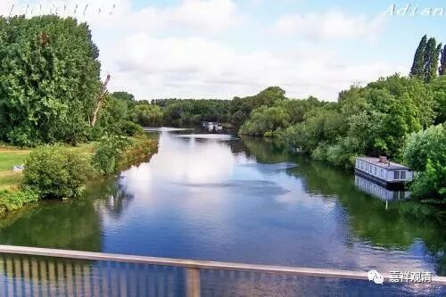

**《菩提速道》02（下）**

** “圆满圣教善慧海，讲辩著涛浪飞空，**

** 洁白美誉溅十方，顶礼善慧名称足。”**

** **

** “圆满圣教善慧海”、“顶礼善慧名称足”，**这里的** “善慧海”**、** “善慧名称”**就是宗喀巴大师了，宗喀巴大师本名洛桑扎巴，翻译或来就是“善慧名称”，或称“洛桑扎巴贝”及“洛桑扎巴贝桑布”，译为“善慧贤称”或者“善慧贤名称”。本颂是在赞叹宗喀巴大师。“** 讲辩著涛浪飞空**”，是说，宗喀巴大师讲、辩、著的功德很伟大。“讲”，就是讲经；“辩”，就是辩论；“著”，就是著作。讲、辩、著三俱佳的大师，在历史上都是很少见的。比如有些格西辩论方面很出色，著作就出不了手。“洁白美誉”，就是对宗喀巴大师“扎巴”、“名称”一次的解释了，“** 洁白美誉溅十方**”，就是名称普闻。这一颂是在赞美宗喀巴大师。

之前先礼赞深见、广行二派的大师，而阿底侠尊者身兼此二派的教授，下启噶当派一脉。噶当三昆仲，演出噶当教典派、教授派、道次第派三系传承，至宗喀巴大师，汇此三脉而合流，成为新噶当派——甘丹山派、世人称为吉祥格鲁派的传承。

** “善慧法幢胜士擎，”**这是指第四世班禅大师，他的名字叫** “善慧法幢”**——洛桑确吉坚赞。昨天我们还看到，在民国时期西北出现了一个新兴的宗派，叫法幢宗。（唉，有录音其实也是挺麻烦的。我们先不管录音了，我就先走嘴了算了——该骂的骂，该聊的聊。）有一个汉人，好像曾经是学禅宗的，在藏地呆过一段时间，好像是在九世班禅大师的座下灌过顶，也受过戒，给了他一个法名，可能就是这个“确吉坚赞”。然后他就自己开宗立派了，说自己显密兼修，反正特别厉害的，也像今天你们所听到的什么“上师位”啊、“金刚阿阇梨”啊，就开山立派了。他在西北建了个寺院叫“法幢寺”，“法幢”就是他的名字嘛，又出现了很多弟子，自称法幢宗。那个时代，在西北比较大的几个城市——兰州和西宁等等，都有他很多的弟子，也有很多的寺院。其实今天西北的好几个大寺院，都是他流传下来的。

但是如果你真的去追究的话，这个事情肯定有些麻烦的。这个法幢宗的背景，是不太好去过分追究的，过分追究下去的话，又变成类似民间宗教的情况。当然，这个不能被西北人听到，现在好几个西北大寺院都是属于法幢宗的，而且在西宁的什么山下又重新恢复了法幢寺。有些新的出家人，包括西藏人，又不知道这是什么地方，当然会维护这些地方。实际上这个法幢宗有点奇怪……

