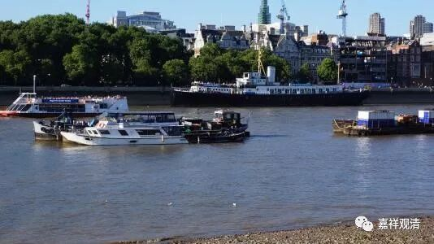

**《菩提速道》003（中）**

** “初者，如同江河的水源，应源自雪山，”**这个也没法辩论的吧？江河的水源不一定来自于雪山，还可以有我们莲花山，哈哈！这应该属于修辞手法，“赋比兴”的“兴”，引出下面的话——** “同样，正法的流传应上溯到圣教的教主——清净圆满的佛陀。”**

** **

** “此三士道次第，有广行道次及甚深道次两种。”**这里的“道次”就是道次第的简称——西藏也喜欢简略。** “前者从清净圆满的佛陀传给至尊弥勒，其后由无著、世亲兄弟等次第相传而来；后者从清净圆满的佛陀传给文殊菩萨，再由龙树菩萨等次第相传而来。最终这两种传承汇集于阿底峡尊者。”**

** **

这段都是就事实而言的，这个事实是什么呢？就是宗喀巴大师的道次第传承，往上追溯的话，肯定终归要追溯到阿底峡尊者。而阿底峡尊者再往上追溯呢，就是中观、唯识这两大流派。当然，广行和甚深这两种道次第呢，并不完全等同于中观派和唯识派，但是大致上可以这样泛泛地对应。既然是中观和唯识这两支大乘的系统，再往上推就是弥勒菩萨和文殊菩萨，再往上推就是佛陀。那么，从佛陀顺着写下来，就是上面这段的背景。

** “总之，在圣教中，龙树菩萨素来被称为第二佛陀，”**在龙树菩萨那个时代，确实是称他为“第二佛”的。在释迦牟尼佛的时代，舍利弗也被称为叫“第二佛”。** “而龙树菩萨所通达的一切佛法，阿底峡尊者亦无不通达，因此阿底峡尊者应生起他是圣教宗主的敬信心。”**这个呢，从我们今天的角度来看，是比较宗教化、文学了一点，是吧？龙树菩萨所知道的，阿底峡尊者全都知道。如果历史一点看问题的话，两者的知识范围还是有点不一样的。一般来说，我们说“你所了解的我全都懂”的话，意思是“我比你厉害多了”，是吧。这里没有这个意思，仅仅说，阿底侠尊者有来自龙树菩萨不间断的清净传承。

