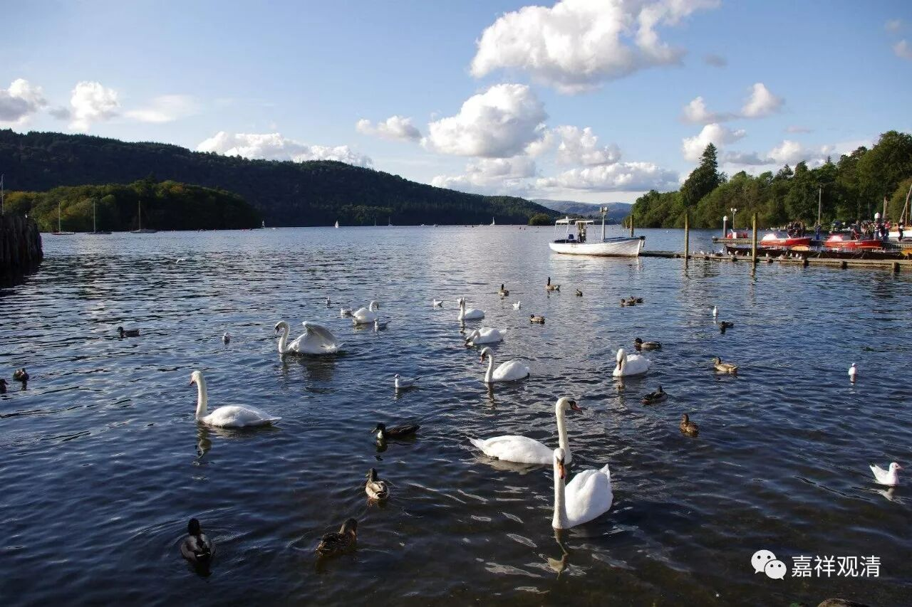

**《菩提速道》004（下）**

我们从留存的道次第师承文献当中可以看到，早期的嘎当派的教授都很平实，离我们的生活很近，看起来真的有点类似现在的南传佛教，有点像原始佛教，很贴近大家。

我自己私下有个想法——没有考证过，可能是和阿底峡尊重去过苏门答腊金洲大师那里有点关系。金洲大师那个时代，苏门答腊虽然是大乘佛教，甚至也有密教流行的背景，但那个地方也是传统的南传教区，或者今天我们讲的大寺派流行的背景。在这样的背景下，对戒律和声闻教法的实践应该是比较多的。我们在阿底峡尊者的传记当中也看到，他们那么多比丘出来迎接的时候都是很如法如律的，是可以看出来受到了声闻教法的大量影响。（我也可以提醒一下大家，以后有机会是不是一起研究一下呢？最近又发现了金洲大师的文献哦。）

南传系统中，对慈悲喜舍四无量观是比较重视的，这一点，我们在觉音大师的《清净道论》中可以看到，而四无量观的修法，和菩提心修法有相似之处……

我们现在是属于私下聊哦。如果大家看一下菩提道次第当中菩提心的修法，宗喀巴大师是把增上心放在菩提心的前面（照如石法师的说法，早期噶当派的教授里，“增上意乐”这一支本来是放在“菩提心”这一支的后面），再往前面是慈心和悲心，在慈悲以前所有的这些修法，你们看看是不是和南传“四无量”的修法很接近呢？在此之后进行了一些大乘的抉择，后来经过噶当派而至宗大师的抉择，就变成今天的菩提心七因果的教法——是不是这样呢……

