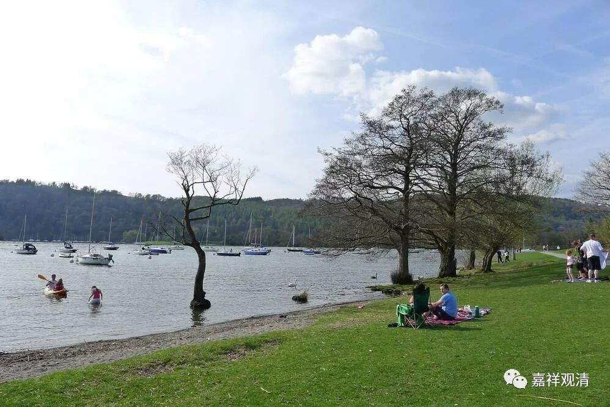

**《速道》005（中）**

** “此外，由仲敦巴尊者传给善知识博多瓦。博多瓦传给善知识多瓦及霞热瓦的噶当教典派道次第传承，宗喀巴大师从扎古寺大堪布法护贤处获得。”**“法护贤”，在有些地方被翻译成“法依贤”，都一样。也就是，宗喀巴大师又把从阿底峡尊者传来的教典派道次第，重新汇聚在身上。

** “这些上师传承的次第，就像《道次第祈祷颂》中所说的那样，非常清楚明白。”**也没有任何遗漏。

** “宗喀巴大师起初把文殊菩萨所讲的三要——出离心、菩提心和清净见作为修行的重点**（就是核心）** ，后来，在热振寺迎请来著名的阿底峡尊者“侧首像”，并长时猛励地祈祷，由此，亲见从圆满佛陀直到洛扎大成就者虚空幢之间的一切传承上师，尤其亲见阿底峡尊者、仲敦巴、博多瓦、霞热瓦诸位善知识，长达一月之久，获赐许多教授教诫。”**

** **

这段记载在当时的西藏是很重要的。对于我们今天来说，好像也没觉得怎么样，大家并没因此而生起很强烈的信心。而对于当时的西藏人，可能就因此而生起了强烈的信心。这还给了我们辩论的资料，我跟宝僧师好像在这里有辩论过：“阿底峡尊者不是已经圆寂了吗？”“是圆寂了啊！”“那宗喀巴大师明明见过阿底峡尊者在他面前现起来嘛。”……

** “最后，博多瓦等三尊融入阿底峡尊者，尊者舒手摩大师顶说：‘你应当对教法作广大的事业！在你修行菩提、利益众生方面，让我来做你的助伴吧！’言讫不现。像这样稀有的征兆出现了很多。”**

** **

这些都是在夸宗喀巴大师。我们要把这些内容放在历史的环境下来讲，就是在当时有那么多僧人的背景下这样讲这些话是有用的哦。如果今天我们是在复旦大学的论坛上讲这一段，下面的那些学者们都快被烦死了，就不是一个套路。大家的套路是不一样的。

