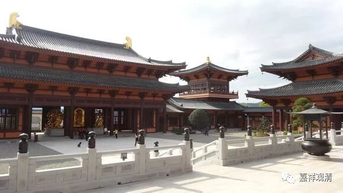

**《菩提速道》006（中）**

** “那时，在大堪布素浦巴宝吉祥贤，以及大译师胜怙吉祥贤等的劝请下，宗喀巴大师著作了《菩提道次第广论》。”**那么，用我们佛教中常说的话，宗喀巴大师的这个《菩提道次第广论》也是因缘生的。通过这样的劝请，而他自己也有这样的能力，然后就著作了这部《广论》。

现在我看到一些格西们写论文也是这样的，他的论文写完了，最后会说“某年某月某日在某某的劝请下，我参加某某论坛，著作了这篇论文”。而且很有趣的是，他们基本上就是那几个扎仓出来的，有时候写同一个题目的论文，就相当于十个人写同一篇教材。他们不像写论文，就像写教材，而且写出来的内容也都差不多，因为是同一个学校里面出来的。他们都是背出来的嘛……

** “对此，文殊菩萨问道：”**据说文殊菩萨是在宗喀巴大师面前直接显现的——不是做梦，不是观想，而是直接面对面这样。** “‘你著作的论文内容，难道没有包含在我所讲的出离心、菩提心、清净见三主要道里面吗？’”**文殊菩萨也很幽默嘛，和宗大师开玩笑：“我教给你的还不够大家学的吗？你咋自作主张一写一大堆？”

** **

** “大师禀道：”**宗喀巴大师还顶嘴呢，要是我们早就吓趴下了，肯定跪下来磕头如捣蒜：“我错了，原谅我。”大师的境界和我们不一样啊！** “‘不是的。’”**他还敢顶嘴哦。** “‘这部论是以三主要道为命脉，补充以《道炬论》等的教理，结合成为三士道次第而写的。’”**这是什么意思呢？我以你讲的《三主要道》呢，作为最重要的核心，然后再增加一点丰富的肌肉，比如阿底侠尊者的《菩提道灯论》等等作为扩充，并没有在“三主要道”以外的内容，三主要道是核心。这里等于又在说：圣教的核心是：出离心、菩提心、空正见。那今天的话来说，就是：1、对解脱的追求；2、道德的承担；3、智慧的实践。

