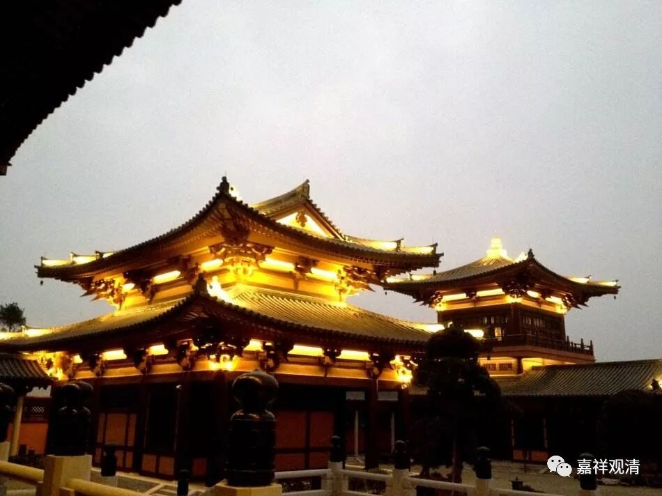

**《菩提速道》007（中）**

世间的因果，实际上所有的事物，都不是单一性的因果成立的，不是一个因就能确定一个果的，没有单纯靠一个条件就能确定一个事物的。但是，为了讲述起来更容易令人明白，在阿毗达磨当中或者其他佛法学习的时候呢，通常都是单一的描述，而事实上事物并不是单一条件的。甚至我们在世间的一些学习和工作，也能够对我们教法的学习有帮助的，那就是你要去思维义理啊！其实很多背后的内容都差不多的。这里面重要的就是我一直谈到的“自我反省”的问题。我们能不能够反省呢？能够反省了，这个人可能就有机会了。

与此相关的还有一个问题，就是我到现在一直都觉得，对于80后的教化我有点找不准方向。我们看中国历史上的很多教法，是怎样教化的呢？真的是不给答案的。只是让你去找做就好了，或者给一个暗示。对你来说呢，可能是某一天突然之间你就突破了，甚至可能是你在稻田里割稻的时候，突然就理解了师父的意思了。

师父在之前的时候是不能把这个意思告诉你的，那时候告诉你也没有用。所以禅宗里怎么说的呢？“描也描不成，画也画不就。”我给你描出来、画出来的，其实也是没用的——“纸上得来终觉浅”，必须要你自己去体会出来，这句话才会变成活的。所以呢，禅宗里面，哪怕是要点破的时候，也就点一两句话，不能讲太多，还是需要你自己去解决问题，这才是重要的。

最后你会发觉，其实这些道理以前都是学过的，自己也都是知道的。我们学习道次第也是一样的，看看道次第的内容都是讲过的嘛，全都是一样的。现在《广论》班的学习也是同理，如果单单在这个《广论》班的系统当中学习，可能还是学不好《广论》的。所以，在这个背景下，即使你是教授派的，或者你是道次第派的，你应该学习一些其他的经律论等等，对你本身的学习是会有帮助的。

那么，藏传的经院派的学习是不太一样的，他们是一步一步来的。我这段时间在写论文的时候也看到了他们的情况，比如说能海上师去学《现观》的时候，他的师父就把其他的书全部收光，只给他般若经或者《现观》的书，其他书都不给他看。可能在他们的体系下是可以的，但是在我们今天，恐怕还是知识面广一点会比较好。

当然不同的人，也会有不同的学习方法。藏传经院派的学习，就有点像我们以前莲花山上白云寺的素斋，每道菜都是一个单纯的清炒，豇豆就是清炒豇豆，土豆就是一个炒土豆，丝瓜就是清炒丝瓜，没有两三个菜混起来炒的，所以看起来倒是特别干净。其实混搭也不是不可以，或许还更有变化。

