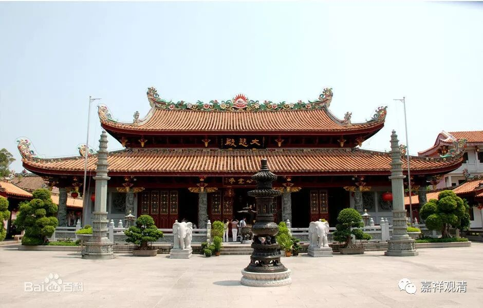

**《菩提速道》007（下）**

我们回到《速道》吧。在宗喀巴大师的传记当中说，宗喀巴大师在后期是以亲见的方式见到文殊菩萨的，而早期是在禅定当中，然后还有人转述。宗喀巴大师问乌玛巴大师，乌玛巴大师再转述……到了后期，宗喀巴大师就能够直接亲见文殊菩萨了。

其实我们会说，是否亲见文殊菩萨不重要，这些神迹都不重要，关键是所讲的内容。包括对龙树菩萨也是一样，我们觉得龙树菩萨是否被佛陀授记过也无所谓，只要他讲的这些内容都是对的就行了。那么宗喀巴大师的情况也一样，文殊菩萨不现出来也无所谓的，只要所讲的内容牛叉就行了。其实当时说龙树菩萨被授记呢，是针对大乘的其他宗派或者小乘的一些宗派，都是针对自己人的，意思就是你们应该相信龙树菩萨，是佛陀给他背书的，佛也给迦旃延背书了，如果你们都不相信的话，那我们就在理性上谈一谈吧。关键不是神迹，是解脱法。

可是，你也不能在传播这一方面有缺失，是吧？退回到两千年以前，大家都是搞宗教的，他有神迹而你没有神迹，那你首先输了一招，他有授记而你没有授记，那你又输了一招，你肯定输啊！他有的，你也必须有。他如果是右胁生出来的，你也必须是右胁生出来的。其实佛教是不讲顶髻的，但是印度教和婆罗门教都讲顶髻，其他大师的脑袋上都有个顶髻，那没办法，后期的佛也必须有中间凸出来的顶髻，最后连龙树菩萨也凸出来一个顶髻。宗教的江湖上大家都要凸出来一个顶髻，你要是不凸出来就没法混。这就好比现在的江湖上，大家都在做火供，你不做火供的话，至少做火供的那批人就不会过来了。然而，这种方便终归不是解脱。

