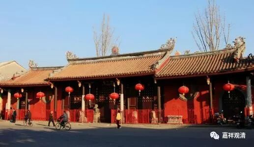

**《菩提速道》讲记008（上）**

** “宗喀巴大师著作此论的过程中，有着如此不可思议的秘密史迹。因此，这些道次第的要点，也可以说是文殊菩萨传授给宗喀巴大师的。**

** **

** 宗喀巴大师有许多受持这个法脉的弟子，传承情况极多。其中，温萨巴父子所听受的传承，是从宗喀巴大师、贾曹杰、持律大师名称幢、克主杰、慧狮子、持律慧隐、班禅法幢、胜护贤、成就自在善慧义成（**祈竹仁波切的名字也叫善慧义成）** 、佛智、班禅一切智善慧法幢，直至金刚持宝幢吉祥贤一脉相承而来的。我从宝幢大师处圆满地获得此法恩。”**

** **

这是把教授的来源就说了一遍。这个还算比较近的，如果放到今天的话，师父的名字恐怕要背一长串了，“我的传承是……”，大概要背四十几个名字，要拿法卷出来了。

** “另外，还有由宗喀巴大师传给慧狮子，再至持律慧隐的传承，持律慧隐以下相同。还有由宗喀巴大师传给持律名称幢，再至慧狮子的传承，慧狮子以下相同。”**在网上流传的一个版本当中，因为** “以下相同”**几个字没有，所以很多人就对不起来了。

** “宗喀巴大师在著成《菩提道次第广论》后，删去其中引经据典和广作破立的内容，摄其全面的心要，著成《略论》。虽然是那样，但因所化有情的慧力每况愈下，于《道次第广论》中，大师曾慈悲地说：‘然能了知一切讲说皆为修持者，实属少际，故能略摄所应修事，亦可别书。’”**意思就是说，既可以按照这么广的道次第讲说，也可以另外再编比较略一点的道次第。

** “依此密意，第四世班禅一切智著作了《菩提道次第直授安乐道》。法王一切智（第五世达赖喇嘛）著作了《文殊口授》。这两部论著，篇幅广略适中，”**其中，《安乐道》比较略一点，《文殊口授》比较广一点。

** “又有教理的抉择论证，后学者若能依之而修，实无不可，”**依照这两部论著学修也是可以的。** “然因他人殷重劝请，同时又考虑到自己往昔所集的福力微弱，智慧浅薄，若能藉此因缘，对道次第生起更深的悟解，比起一味探求高量的地道诸果还要关键重要，因此，对道的数量、次第、各各道的体性等方面，尽自所解，叙述如下：”**

** **

也就是说，五世班禅大师在这里讲述了他著作这篇《速道》的原因，是为什么呢？在佛教史上这个是一个长期的习惯，就是把篇幅比较广的论著收束为略。你看，在般若经当中也有广的，也有略的，最略的就是《心经》。龙树菩萨的著作当中，广的有《无畏论》，十万偈；略的呢，有《中论》，一卷；再略的呢，《十二门论》，这是由广到略。唯识系统也是一样：广的呢，就是《瑜伽师地论》；略一点的呢，《显扬圣教论》；再略一点的呢，《庄严经论》、《唯识三十颂》。都有这样的一个传统——从广到略，能广能略。

就像龙树菩萨先是著作了最广的《无畏论》，之后再著作了《中论》，再著作了《十二门论》，道次第系统也是一样的。首先呢，宗喀巴大师著作了《菩提道次第广论》，是决择了整个佛法的内容，是最广的。然后他做了和龙树菩萨一样的事情，又著作了《略论》，又著作了《摄颂》，也是由广到略。而且，宗喀巴大师自己在书当中也说了，就是你可以自己再把其中重要的内容摘录下来，作为你实修的背景。于是，这就造成了后期格鲁派系统当中出现了大量的道次第，像《乐道》、《速道》这样的书。

