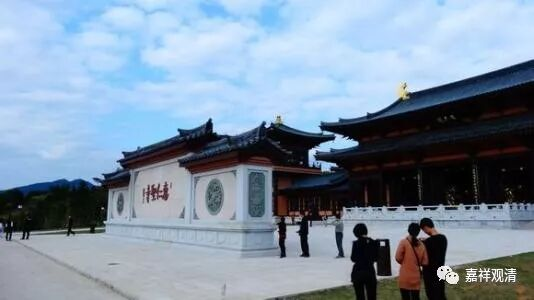

**《菩提速道》讲记010（上）**

** **

所以智者大师还是挺厉害的，在这么多的经典当中，从《法华经》中抉择出了这一句话。这个确实是佛教的核心，并不在乎它本身有多少实际的内容，而是有了这个佛的密意以后，后面“藏通别圆”四种教法就出来了，是吧？因为他要把佛的所有教法都整理出来，通过这句话他就看出了所有这些经典的密意。

我们平时在家里也是一样，如果大家互相认为对方都是为了我好，那么很多事就好说了，就简单了。当然，你得首先确定他确实是佛，确实是为你好，否则就是傻——他本来就不是为你好，你还觉得他对，那就是被骗了，就傻了。

怎么确定呢？很难啊！聪明人很难得啊！其实我想过这个问题的，聪明这个事情真的是非常难。有时候布一个大局的时候，可能所有的人都会被瞒在里面的。如果真的是佛在布一个大局，你会发觉至少从《妙法莲华经》叙述的层面来看，早期的声闻众是没有看透佛的密意的，他们是太急了，太急着想成就了——这是借那些罗汉的口所讲出来的。

至少在《妙法莲华经》的背景下，早期的这一批声闻教众虽然说都可以算是成就了，但是他们没有看破佛的密意。这也是为什么他们当中的有些人被称为“焦芽败种”，因为他们没有看破佛的密意。最后佛在讲究竟法的时候，他们又以为是方便法。

实际上佛是要让众生都悟入佛之知见，不是想让大家仅仅解脱烦恼就可以了，仅仅解脱烦恼是不够的。后面讲到究竟法了，却又被他们认为是方便法，其实前面所讲的声闻的解脱法，针对大乘来说，就是一个方便法。它是一个化城，还是方便。那些直入大乘的人，在前面呢，也不太用功，熬到后面呢，佛讲究竟法了，他们就证到了，这也是一些习气的缘故吧。

至少在《法华经》这一系列的经典当中，想要说的是这个意思，把声闻乘称为劣乘的原因也在于此，就是他们没有看破真正的佛的密意。所以他们的解脱不是究竟的解脱，既然不是究竟的解脱，那假如把“究竟的解脱”定义为“解脱”的话，他们这种解脱根本就不算解脱了。因此，我们要知道佛所讲的这一切，无不是为了利益有情，全部都是为了你好。

