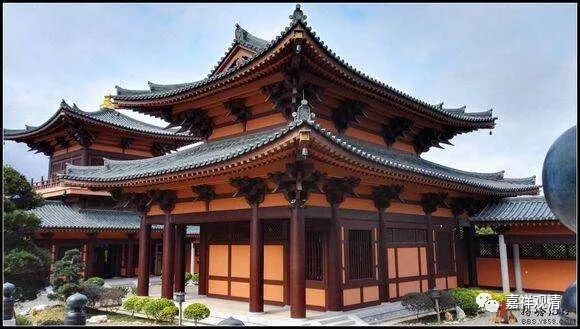

**《菩提速道》011（下）**

其实佛陀在讲戒律的时候就特别明显用这种方法。“嗯，这个地方，吃饭没问题的，三顿四顿都没问题。”“这个地方吃饭还是有点问题的，那吃一顿二顿就可以了，不要太多了。”

我们打个比方，如果佛陀到上海来传法的话，他就用上海话。人家问他：“我们能不能用西北印度的标准梵语来讲啊？”“不行，就用你们的土话讲。”这部分人就去对那些用精英语言的人说：“佛陀在我们那里讲了，就用土话讲，不允许用梵文。”其实呢，也不见得是不允许，干吗要否定另外一种方法呢？是不需要否定的嘛。只是针对这种人，当时这就是最好的方法嘛。

其实那个时代做佛还是挺容易的，两百年前做活佛也是挺容易的，但是今天那些活佛再沿用两百年前这套的话，就会觉得有点举步维艰，有时候自己下不来台。现在也可以看到一些在西藏的大活佛还是这样的习惯，就会出现这样的问题——在这个山沟说应该这样，在那个山沟说应该那样。等到两方面的人一碰到，就悲剧了，都不知道怎么办。

比如说，我在这里讲：“修行一定要注意，要以道次第为基础的，怎么可以搞个人崇拜呢？我们佛教是不搞个人崇拜的。”然后，我去到另外一个地方，又讲：“修习道次第最基础的就是依止善知识，善知识就是佛，对我们来说，善知识比佛都重要。”然后这两个地方的人一碰到，这个人说这个重要，那个人说那个重要，两方面讲的是反的。其实，他们是没有通达我所讲的背后的密意。

另外一方面，我也发现了一个原因，医生的问题是这个原因，学佛也是同样的原因。那就是，医生跟你讲的不可能很完整，他不可能把整个的生理学、病理学、治疗诊断学都跟你讲一遍。佛教也是一样的，我在你们这里讲经，最多讲一个月，不可能面面俱到——其实是应该面面俱到的，但是你们也只能听到这里了，你们真的要学习的话，可以到我那里去长期地学习。再到另外一个地方也是一样，七天、半个月、一个月……那也只能讲到一个大概的程度，也不可能面面俱到——虽然应该是要面面俱到的。那么。大家都认为我已经全部都讲完了，其实是没有真正通达我的密意。

实际上来说，确实应该广泛地去理解，或者你觉得出现矛盾的时候，还是要去问师父本人。病人出现问题的时候，也还是应该去问医生本人，就是态度要好一点：“为什么你给我吃这个药？那个医生说这个药不好。”你要想办法问问清楚，问他本人是最好的。其实通常医生是有想法的，他是为你好——这个真的最重要、最难的。

拜师父也是这样。你已经拜了具备前面讲的十个功德的这么好的师父，他又同意接受你成为他的授受弟子，那他所有行为的背后就一定是为了你好。当然，如果你在前面是随随便便拜了一个师父，那其他的事情就可能有问题——你有多标准按照道次第的来实践，就有相应的修行的内容在心里升起；你有多少偏离道次第的教导，就要相应地在那里吃亏——都是自己的选择！

