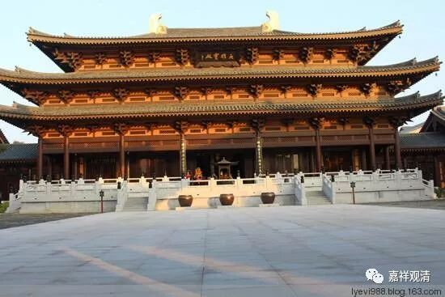

**《菩提速道》讲记012（上）**

我们继续学《菩提速道》。

道次第实际上是实修手册——这个已经是老生常谈了。昨天我们在民族博览会上也谈到这个事情，现在外面的《广论》班很多，但是《广论》到底是一部什么样的著作？是不是把它当作知识来学的呢？其实不是。但是，很可惜的是，我们确实不怎么学习佛教知识，所以也没有办法，就有人把《广论》当作佛教知识来学习。

道次第这个系统实际上是一个实践的系统，现在我们好像还是把它当作知识来学习……没办法了，大家在基础方面还是不够了解。其实从道次第本身的文字来说，是并不难以了解的，所以西藏人听到我们汉地如此认真地学道次第，都觉得有点奇怪。我曾经跟金巴师父他们聊过这个事情，他们就说：“啊？这个不是很容易的嘛？怎么需要这么努力学习的呢？……”他们都没有专门学过道次第，觉得这是一个不难的东西。

对我们来说，就好像比较难。可能有一方面的原因，就是我们大部分学佛的人——在座的各位可能情况稍微好一点，哪怕是学佛很多年的人，都不知道学佛是需要认真学习的。大多数人都认为拜拜佛就差不多可以了。这就跟我们讲的民间劝善说、民间因果说的背景一样，他们就是那个化机。他们觉得学佛就是“念念经、拜拜佛”，然后家里有事了，找人超度一下就行了。这种就是他们的宗教意识。但实际上真正的佛教，和其他宗教，或者和他们心里所想的那种佛教完全是两回事。真正的佛教确实是需要学习的，而我们的基础确实有点太差了。

不过呢，这又是一个很新的课题，中间层次的这种人是历史上没有出现过的。以前学佛的人只有两种层次的，其中的一种就是文盲。你可以看到，对这些人来说，不管是净空法师还是某些禅宗法师都讲得对，为什么呢？对于文盲，你让他“只管打坐”——对啊！他还能怎么样呢？“只管念佛”——对啊！他就只管念佛就行了。但是现在，中国大部分人至少是初中以上文化水平，实际很多都是高中以上文化水平，他们对于佛教是想要深入了解的，可是他们却没有正确的渠道去了解。

