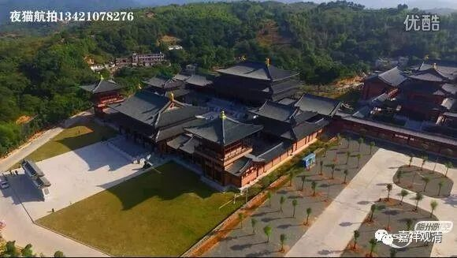

**《菩提速道》012（中）**

我曾经有一次被人忽悠，走到民间去给老太太们讲了一次课，时间是前年的一月一号，那次真的把我搞得很惨。那个邀请我的兄弟呢，就跟你们差不多，一个搞国学的和尚，他就说“我们这里有个很好的法师，给你们叫来”，结果我的同学寂如师就专门推荐了我。我一看寂如师那么认真地推荐，还以为有什么大事，就飞过去了。结果发现，他给我约了很多村里面的老太太，让我去讲课。既来之则安之，我也就讲了……

我后来才发现（在这方面我也有点惭愧的，我们走下去很少）确实民间存在着大量的佛教需求，大家想知道“佛教是怎么回事”。但是呢，法师们没有沉到民间去，没有走到大众当中去，而大众最容易得到的就是净空法师的光盘，最容易得到的就是慧律法师的光盘或者是传喜法师的光盘。于是他们觉得这些都是对的，听着听着就被催眠了，觉得都是对的。但还是要说，民间的、最基层的这些大众，他们是有这方面的宗教的需求的。

一方面来说，那次讲课我其实不是很高兴的，但是另一方面，我也由此了解了民间的佛教需求。应该说，确实我们也是有些亏欠的，应该给他们多讲一讲。（龙相师，我给你安排一次巡回演讲，怎么样？你担心他们听不懂你的普通话？当然听得懂普通话的！）只是有个别的老太太，听得烦了的倒是也有的，她就嚷嚷：“你讲完了没有？我们要绕佛了。”

其实有些人并不是文盲，还有退休的老师，他也是找不到学习内容的人，结果他学的还是那些底层的佛教。后来他被我骂了，反而很高兴的，连听了两个小时：“对啊！你讲的都是对的。”我的中学老师也是，每天都给我发佛教的微信，看得烦也烦死了，我和她说：“某老师啊，算了，你别再给我发了，我受不了了！”但她确实也挺主动地想要学宗教。

