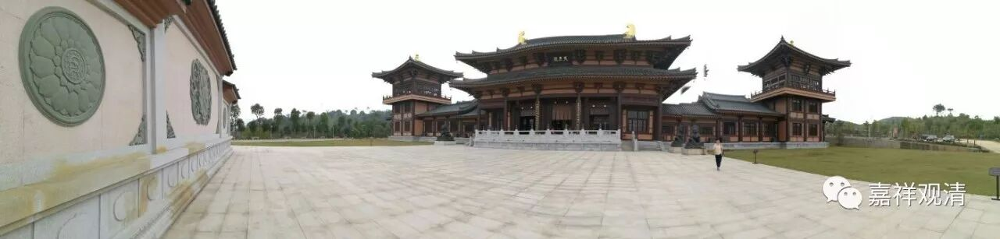

**《菩提速道》012（下）**

那么，我们再回来看《菩提速道》。是不是一切都可以摄入三士道当中呢？有什么理由呢？

** “所有佛经中开示的一切道，都可摄入三士道次第中者：因为诸佛从最初发菩提心，中间积聚广大资粮，直至示现圆满成佛，无不是为了利益一切有情。因此，所说的一切法也都是为了成办有情的利益。”**就是为了大家的好处，为了让大家能够得到好处。** “要成办的有情利益，有现前的增上生和究竟的决定胜两种。”**现前的“增上生”，也有翻译为“安乐”的；究竟的“决定胜”呢，就是解脱。就是说，对有情或者对众生的好处，不外乎是两种：眼前的“增上生”和究竟的“决定胜”，即眼前的安乐和究竟的解脱。

** “从着眼于成办现前增上生方面出发，所说的尽所有法门，都摄入共或正下士道的法类中。”**就是说，在安乐这个方面，下士道的内容都可以算在里面了。下士当中有正下士和共下士。也就是说，为了现在和将来获得世间安乐的方面。

** “决定胜又分为解脱和一切智两种：”**解脱又分为两种：一种是二乘——声闻罗汉、独觉罗汉的解脱，广一点讲就是阿罗汉的解脱；一切智的解脱就是成佛，就是所有的障碍全部都断除。这两种就是决定胜。** “为成办解脱所说的尽所有法门，摄入共或正中士道的法类中；”**单单成办二乘解脱的，就属于共中士道和正中士道的范畴。在大乘当中，这个就称为共中士道，因为它是和正中士道所共的，那么正中士道就是二乘的，他们这一类的修行方法，就称为中士道。** “为成办一切智所说的尽所有法门，则摄入上士道之中。”**广的修行，和成佛直接有关的这一类都摄入上士道当中，也就是菩萨道当中。

三士道的类似说法，可以在《瑜伽师地论》里见到……

