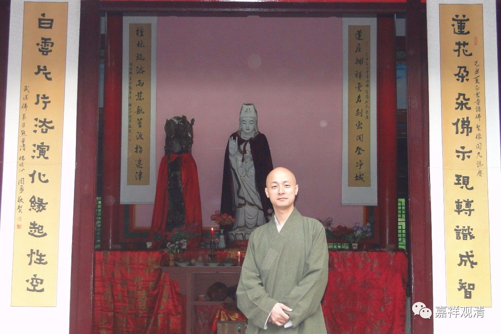
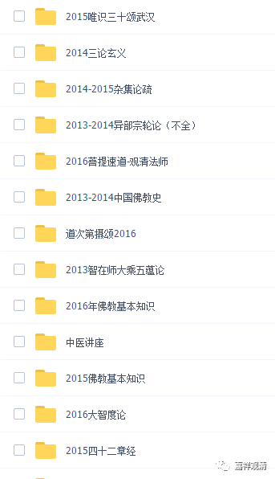
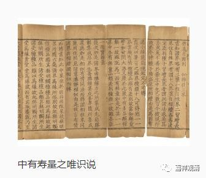
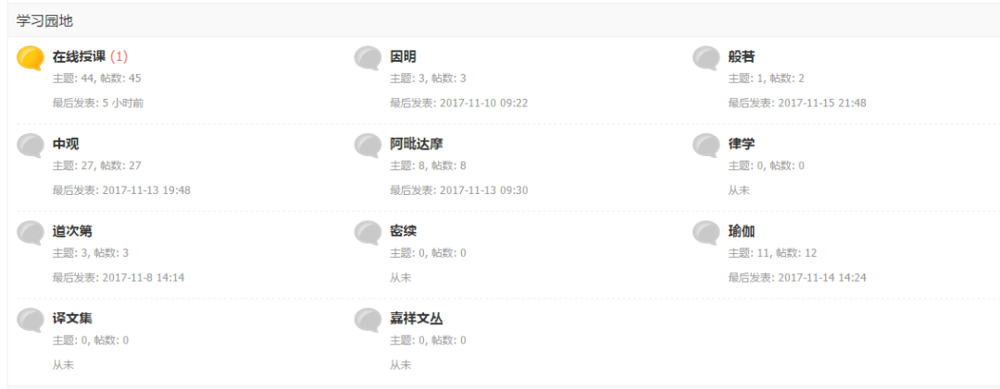

新年新气象，锵锵锵锵！我们的**观清论坛** 上线啦！

电脑浏览网址：**guanqing.org**

手机用户二维码：

（长按，识别二维码，即可）

本论坛是我们的观清师父特意为方便大家获取佛教学习资料而创办的。

师父的个人介绍请戳这里

在观清论坛，我们会陆续分享观清师父和其他大德历年来的很多讲课录音、录像，如：

也会分享师父和其他法师、学者们的佛教著作、文章：

论坛刚刚成立，所有版块会陆续填充：

并且，香港嘉祥基金会和上海慈慧文化研究所出版的所有佛学书籍都会在这里分享** 电子版**！

未注册者可以浏览页面，注册并通过管理员审核者可在讨论区发文及下载。

重复一遍，我们的论坛网址是：** guanqing.org**

手机用户长按识别二维码：

** 精彩内容不断更新，敬请关注收藏！**

            阅读原文