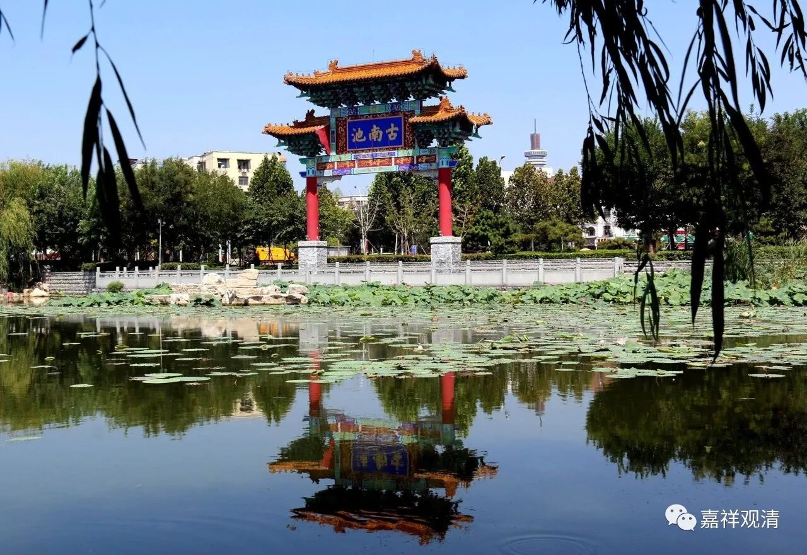

**《菩提速道》013（下）**

** “如《地藏十轮经》中说：”**《广论》当中经常会提到《地藏经》，可不是指《地藏菩萨本愿经》哦，而是指这个《地藏十轮经》。** “‘无力饮池河，讵能吞大海？不习二乘法，何能学大乘？’”**

** **

** “如《道次第广论》中说：‘若自思惟，漂流苦海，安乐匮乏，众苦逼恼，曾无毛竖，’”**这里“曾无毛竖”的意思就是，你想这些事情的时候一点点都没有感动过，都没有激动过，汗毛都不竖一竖。

** “‘则于他有情，乐少苦多，岂生不忍。’”**你对此点一点感觉都没有，怎么会觉得别人苦？怎么会要想帮他呢？不可能的！** “‘如《入行论》中说：“彼等为自利，尚且未梦及，况为他有情，生此饶益心？”’”**他们为了自己的利益，在自己的梦当中都没有梦到过应该怎么去做，他连自利都不去做的话，你说他对别人倒生起了饶益心，这个也太奇怪了。按照正常的情况，确实是应该自己先要生起趋于安乐的心，然后再去观察别人，才觉得这个方面是他人也应该生起的。

** “因此，这里以三士道次第渐次引导的密意，不是为了引导趣入正中、下士道，而是将部分共中、下士道纳入到上士道的前行——净罪积资的支分中而作引导。”**从这里也可以看出，《广论》的观点是究竟一乘的，认为一切众生都是可以成佛的。所以，哪怕是正下士、正中士的话，也是可以把他们拉到上士的道路当中来的。这个意思就是，有些人本来的心没有这么强烈，他们的目的也没有那么高尚，为了要给他们帮助，所以在道次第的内容当中也提到了一些下士道、中士道的内容。当然这不仅仅是为了他们，上士夫也是要修行这些内容的，而正下士和正中士这些人，也会因此而得到利益。

** “若问：‘既然中下士的法类是上士道的支分，那么作为一个上士道就可以了了，何必还要共中、下士道次第的虚名呢？’”**

** “于此当知，把三士分开引导有两大用处：**

** 首先，如此可以摧伏那些中下士道尚未在心中生起，却自诩为上士者的我慢之心；其次，这样对上中下根的有情都有很大的利益。”**

** **

首先呢，那些很傲慢的自诩为上士夫的人，下面共下士道和共中士道的内容他又没有学过，你给他讲这些内容的话呢，能折服他的傲慢心。（不过，他如果是很强大的傲慢心的话，就折服不了他的，你给他讲也没用，他根本不愿意学的。）

我们汉地的这个情况在唐代以后就很明显。大家都知道“藏通别圆”，学修的时候全都是学“圆教”的，没有学“藏教”的，因为没有人觉得自己根器低，都觉得自己根器高，哪怕就像大家现在所讲的“种个种子也好”。你问他：“你是高根器的吗？”他们都觉得自己是最高根器的，或者会反问：“你怎么知道我不是高根器呢？你看，六祖大师连字都不识，人家都做‘六祖’了，凭什么我不可以呢？”于是满街都是六祖，人皆可以为尧舜！乃至到了儒家心学的泰州学派，也说“满大街都是圣人”，人人都“取法乎上”，却失之“脚跟不点地”。

