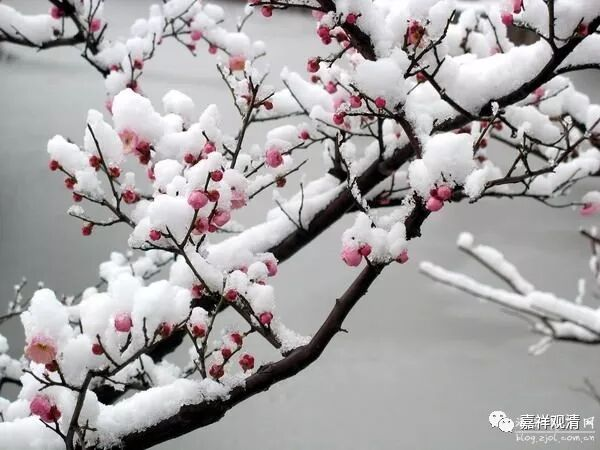

**《菩提速道》015（下）**

** “戊四、清晰观想资粮田。”**这里我也要稍微提一下，因为有无数的人跟我讲了这个事情，有无数的人不修行后面道次第的内容，就是栽在这句话上——“清晰观想资粮田”，因为他绝对做不到“清晰观想资粮田”！

其实这是很简单的一件事情。你把眼睛闭起来，你就观想你现在最亲的人，不管是你的儿子、女儿，还是你的妈妈、老公、老婆等等，你能不能清晰地观想他们呢？绝对做不到的！所以这个“清晰观想资粮田”，是我们从理论上讲最好能够做到这样，实际上不管想得起来还是想不起来，只要大致上知道一下就可以了。否则的话，你这一辈子都别看后面道次第的内容了，到此为止了。在我们念悼词的时候就是：“某某先生，这辈子修道次第，修到了加行部分‘戊四、清晰观想资粮田’……他未尽的事业就是‘清晰观想资粮田’——他一直都没有完成。”不能“清晰观想资粮田”，后面的道次第修行都别进行了？——这是不可能的。

实际上只要大致的观想就可以了。观想资粮田，要在面前出现三百多尊佛菩萨呢，你数一下，三百六十多尊啊！都要现在你的面前，然后每一尊所穿的衣服还不一样，脸长得也不一样，他们面前的经书也得不一样，还得放光，还要有声音……我不真知道西藏的这些格西们是怎么能那么快地观想起来的，我不觉得我能够在刚入门的时候一下子就观想出来，不可能。（超人不要看过来……）

你实在不行的话，就观想一尊好了，观想宗喀巴大师或者释迦牟尼佛——大概有一个脑袋、一个躯干、两个手、两个脚，大概有这些就可以了。反正你真正观想也并不是去修这个样子嘛，其实佛菩萨是什么样子也无所谓的嘛。你观想的时候佛是这个样子，最后佛到来的时候是那个样子，要来超度你，来带你走，你还不去吗？！

即使你说：“你跟我观想的不一样。”佛也会说：“你观想的叫‘三昧耶尊’，我现在这个是‘智慧尊’。”夏坝仁波切不是讲过“三昧耶尊”和“智慧尊”吗？“三昧耶尊”是什么呢？是你在禅定当中想出来的，夏坝活佛又翻译成“定尊”，这是你自己想象出来的样子。而“智慧尊”呢，可以说这尊里面的就是他所充满的，或者说这个境是他本人请过来融入的，叫“智慧尊”。

我们现在实际上只要大致观想就可以了。我曾经碰到过几个南宁的居士，他们受到一位格西的教导。那位格西很认真、很细致地给他们讲解《掌中解脱》。然后他们就很认真地在那里观修资粮田，连平时也在观想，坐公交车也在观想……观想了半年就全部崩溃，不是一个人，而是全体都崩溃。他们碰到我之后，就问我怎么办，我说：“没关系啊！你们不用想那么清楚的，有三百多尊呢，你是没办法一个一个都想起来的。你大致地想想，意思意思就可以了。”这个观修在初学的人当中其实并不重要。（超人继续走开……还有闪电侠……）

那么，如果真的要观修的话，是什么样子呢？如果要修的话，比如说要观修佛，那就把这尊佛像放在面前经常经常看，先看熟悉了。我先举个例子，我们经常听到的“地遍处”是怎么修的呢？在山里面找个没人的地方，把地完全搞平整，把草全部除掉，然后自己坐在中间，把眼睛睁开——这时候一定要睁开眼睛，把周围的地都看清楚了，再闭起来。眼睛闭起来的时候，就想周围的地的样子。如果想不清楚，就再睁开眼睛，再看看这个地的样子，然后眼睛再闭起来，再想，再想不清楚的时候再睁眼……等到你睁眼、闭眼的时候都能想得很清晰，那你可以离开这个地方了，去另外的地方修“地遍处”了。如果修日出、修小日光也是一样，早上起来看太阳，最好不是在山里面，而是在平原上或者看水上的太阳，等到睁眼、闭眼都想得很清晰的时候，就可以走开去别的地方修了。观想佛像，先看一尊自己比较喜欢的佛像……如果学画画就更好了，画唐卡的人很容易想起来……

