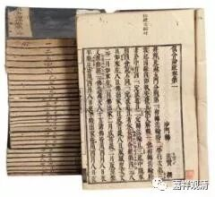

**《俱舍藏文著述列表》**

242Ku, No.4089

ཆོས་མངོན་པའི་མཛོད་ཀྱི་ཚིག་ལེའུར་བྱས་པ།

中文：阿毗达磨俱舍颂

梵文：Abhidharmakoṣakārikā

造者：དབྱིག་གཉེན།（世亲）

西藏译师：དཔལ་བརྩེགས་རཀྵི་ཏ།（祥积护）

印度译师：Jinamitra（胜友）

汉译：阿毗达磨俱舍论本颂，玄奘译，T29, No.1560

242Ku 243Khu, No.4090

ཆོས་མངོན་པའི་མཛོད་ཀྱི་བཤད་པ།

中文：阿毗达磨俱舍释

梵文：Abhidharmakoṣabhāṣyā

造者：དབྱིག་གཉེན།（世亲）

西藏译师：དཔལ་བརྩེགས་རཀྵི་ཏ།（祥积护）

印度译师：Jinamitra（胜友）

汉译：1.阿毗达磨俱舍论，玄奘译，T29, No.1558

2.阿毗达磨俱舍释论，真谛译，T29, No.1559

梵本精校：Prahlad Pradhan & Aruna Haldar, eds., Abhidharmakośabhāṣyam, Tibetan-Sanskrit Works Series no. 8, K.P. Jayaswal Research Institute (Patna 1975). Sanskrit in Devanagari, with introduction in English. The original first edition of this publication was by P. Pradhan only, published in 1967. The introductory material in English is quite extensive.

243Khu, No.4091

ཆོས་མངོན་པ་མཛོད་ཀྱི་བསྟན་བཅོས་ཀྱི་ཚིག་ལེའུར་བྱས་པའི་རྣམ་པར་བཤད་པ།

中文：阿毗达磨俱舍论颂疏

梵文：Abhidharmakoṣaśāstrakārikābhāṣya

造者：འདུས་བཟང་།（众贤）

汉译：阿毗达磨藏显宗论，玄奘译，T29, No.1563

244Gu 245Ṅu, No.4092

ཆོས་མངོན་པའི་མཛོད་ཀྱི་འགྲེལ་བཤད།

中文：阿毗达磨俱舍疏（明义疏）

梵文：Abhidharmakoṣaṭīkā (Sphuṭārthavyākhyā)

造者：གྲགས་པ་བཤེས་གཉེན། (Yaśomitra，称友)

西藏译师：དཔལ་བརྩེགས།（祥积）

印度译师：Viśuddhasiṁha（净狮子）

梵本精校：1. Dwarikadas Śāstri, ed., Abhidharmakoṣa and Bhāṣya of Ācārya Vasubandhu with Sphuṭārtha Commentary of Ācārya Yaśomitra, Bauddha Bhārati (Varanasi 1981).

2.Unrai Wogihara, Spuṭārthā Abhidharmakośavyākhyā by Yaśomitra (Tokyo 1936), reprinted in 1971.

246Cu 247Chu, No.4093; 249Ñu, No.4096

ཆོས་མངོན་པའི་མཛོད་ཀྱི་འགྲེལ་བཤད་མཚན་ཉིད་ཀྱི་རྗེས་སུ་འབྲང་བ་ཞེས་བྱ་བ།

中文：阿毗达磨俱舍随相疏

梵文：Abhidharmakoṣaṭīkālakṣanānusāriṇī nāma

造者：གང་བ་སྤེལ། (Pūrṇavardhana)

西藏译师：པ་ཚབ་ཉི་མ་གྲགས།（巴曹·日称）

印度译师：Kanakavarma（金胄）

248Ju 249Ñu, No.4094

ཆོས་མངོན་པའི་མཛོད་ཀྱི་འགྲེལ་བཤད་ཉེ་བར་མཁོ་བ་ཞེས་བྱ་བ།

中文：阿毗达磨俱舍要用疏

梵文：Abhidharmakoṣaṭīkopāyikā nāma

造者：ཞི་གནས་ལྷ།（止天）

西藏译师：ཤེས་རབ་འོད་ཟེར།（慧光）

印度译师：Jayaśrī（胜祥）

249Ñu, No.4095

ཆོས་མངོན་པའི་[མཛོད་ཀྱི་]འགྲེལ་པ་གནད་ཀྱི་སྒྲོན་མེ་ཞེས་བྱ་བ།

中文：阿毗达磨俱舍要义灯释

梵文：Abhidharma(koṣa)vṛttimarmadīpa nāma

造者：ཕྱོགས་ཀྱི་གླང་པོ།（陈那）

西藏译师：རྣལ་འབྱོར་ཟླ་བ།（瑜伽月）、འཇམ་དཔལ་གཞོན་པ།（妙祥童）

311Tho 312Do, No.4421

ཆོས་མངོན་པ་མཛོ

