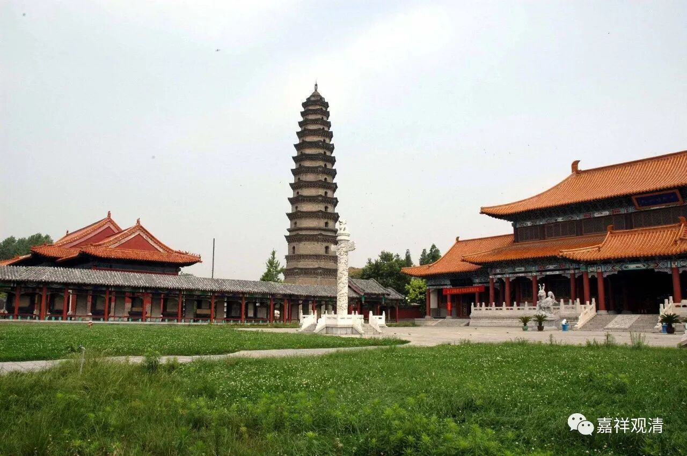
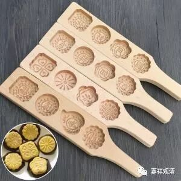

**《菩提速道》讲记018（上）**

** **

朵玛实际上是西藏的一种特别做法，以前在印度也有朵玛，其实就是食品。在敦煌也有朵玛、就是“食子”，类似我们今天讲的糕点。他们专门有一个“食子盒”，其实就是做糕点的木头的模具，把原料往里面一塞，然后敲一敲，一个月饼就出来了。所以，我们供月饼真的很好。很多地方做的，绿豆糕、糯米团，都是食子。饼干也是一个意思。

朵玛呢，就是吃的东西。它本身是什么并不重要，但是你的观想——把它变大等等，却很重要。其实我也觉得挺奇怪的：我的观想能力很差，为什么我念一下就有用了呢？所以，可能更加重要的是，我们知道护法在这里帮我们看着。这就是心理学的背景了，就是有一个事情我已经做过了，我就放心了，如果之后出了什么事我可以找别人的，反正我就不管了。

这个有点像禅宗里面，在打禅七之前，先做些法事，什么意思呢？就是把自己的生命交给护法龙天。你进了禅堂以后，所有的事情你都不管了，全部都交给龙天。死了也是白死，因为你的生命已经交给龙天了，你在里面拼命修就行了。禅宗的方法是比较狠的，而且是用寺院的规矩来解决这个问题的，就是其他的事情你都不要想了。这是比较正面的一种方式：“其他的事情我都已经交给龙天了，障碍都交给龙天了，接下去都是我修行的事情了。”如果出现不好的情况呢，我们的心理也会有一种宣泄的渠道：“出现问题的话，就是你们四大天王没有搞好，反正不是我的错。”这样对修行应该会有帮助，倒不是推卸责任，意思是，除了修行的内容意外，你就不会（要）去想其他的事情了。

** “嘱托事业”**，就是你把这个事情交托给他。比如你是我的副官，或者你是我的秘书，我把这个事情交给你了——** “嘱托事业”**。举个例子，我们说：“魏老师啊，去买点水果吧！”这就是** “嘱托事业”**，让魏老师去干这个事情。或者：“魏老师请开门！”“不管谁进来，你都把他挡回去啊！”请他帮忙做事。因为他比较有经验。

