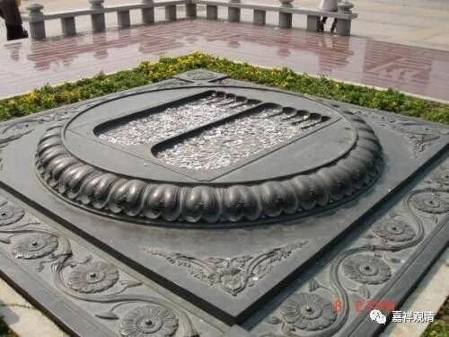
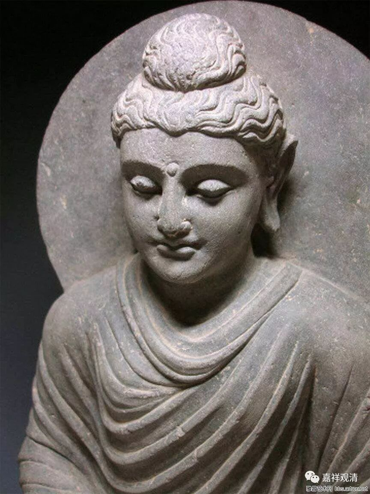
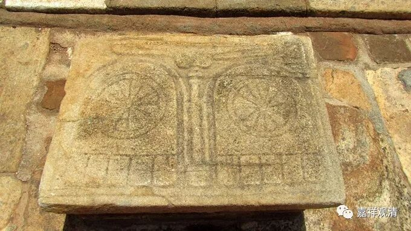
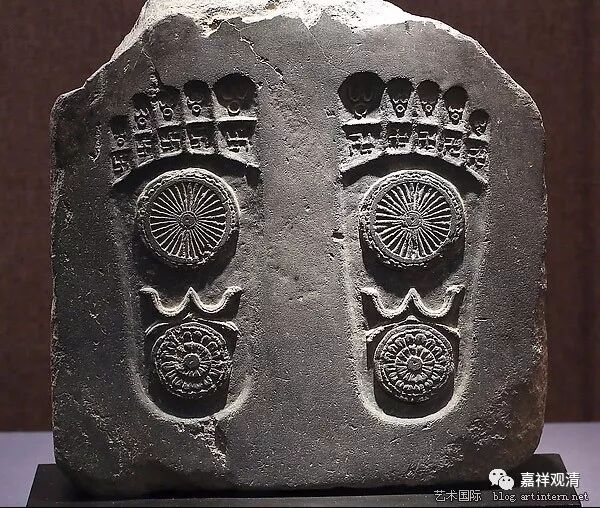

**《菩提速道》018（中）**

** “嘱托事业，净除修习道次第引导的违缘。”**“修习道次第引导”就是闭关的内容。违缘是怎么消除的呢？通过以上这些方式来帮助消除的。

** “成办所需的顺缘。”**成办所需的顺缘也是一样。比方说，你闭关的时候缺东西了，就再供个朵玛，跟护法讲：“我缺吃的东西了，你帮我搞来吧。”（这些四大天王也挺累的哦，搞不来还要被他抓起来打。）

** “将前面的房屋，洒水打扫干净，务令舒适乐意居住。”**就是把房屋整理得干净一点。长期住的地方嘛，干净点自己也舒服。（这在处女座自然就做到了，我就那啥……）** “而后恭敬地陈设身语意三依。”**一开始，就把佛像等等安排好，准备磕头了。佛像、佛经、佛塔。就是这里所说的“** 身、语、意三依**”。

** “陈设身语意三依的方式者：以前噶当派的诸位上师常随身佩戴着释迦牟尼佛像，可将如此的佛像，请来安置于自己面前的高台上，应当生起真佛想。”**那么，这里是说以前噶当派的祖师会随身携带释迦牟尼佛像，那就把这个佛像供上去就可以了。其实没有佛像也可以的，你可以把佛像观想在你面前。但既然闭关，那应该要尽量安排为完整。

** “若无佛像，则可以用‘修持曼扎’代替：在曼扎光滑的表面上，涂抹上牛净物及妙香。若曼扎也没有，可以在如木板或石板上，放九堆青稞或米等，清晰观想此即释迦牟尼佛主尊及其眷属。”**

** **

实际上这样想一想，是需要一个代表。比如说你在山洞里面的话，你就把中间那块石头观想成释迦牟尼佛也可以，然后磕头就行了。不是一定要放一尊释迦牟尼佛的像，你可以观想的，就是一个代表嘛。你看，在斯里兰卡的那个佛的脚印，就是佛的代表嘛——佛在这里站过。你不过就是要顶礼佛嘛，那佛也不是以形象来表现的嘛。所以大概的想一想也可以，有佛像当然更好，一般人都是觉得有佛像更好一些，其实没有佛像也可以。

