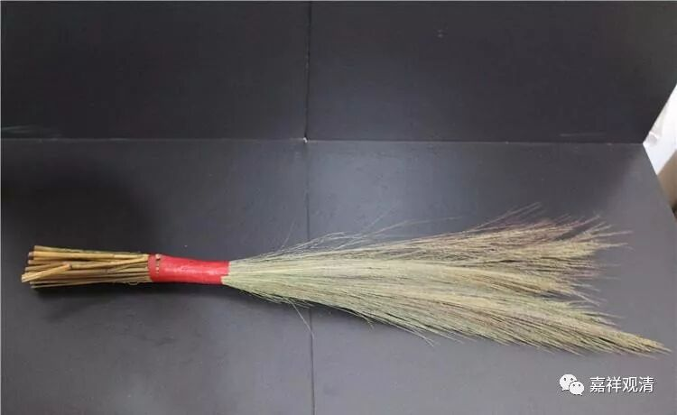
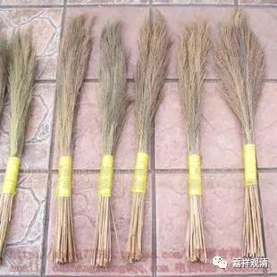
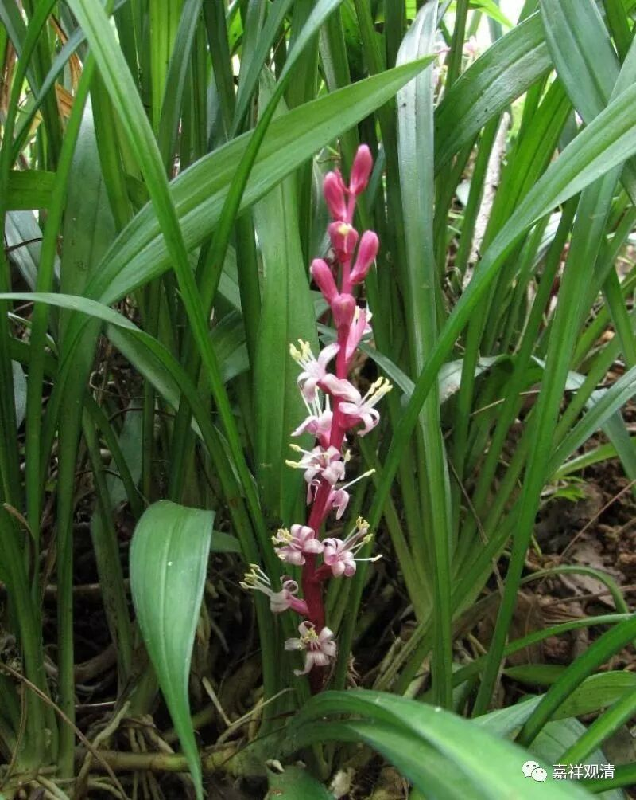

**《菩提速道》018（下）**

** “在自己的坐垫下，用白土画上右旋的吉祥旋，整齐地铺上非常柔软的茅草，尖朝内，根向外。往昔释迦佛示现从卖草童子吉祥处接受茅草，尖朝内，根朝外，整齐地铺成坐垫，于十五日启明星升起时，证得圆满正觉。往昔既有这样的缘起，随行诸佛事迹的所化有情也应当这样修行。”**

** **

这个呢，就是后期的习惯——早期的时候释迦牟尼佛是这么做的，那我也跟着这么做。它是一种崇拜，也是一种心理暗示：“你是这么做的，已经成功了，那我也这么做，也容易成功。”

假设简单地在宾馆几天做闭关的话，也可以比较简单地：首先去外面找两棵茅草，或者是两根芦苇（当然最好是吉祥草……）。然后到可以很容易地找一张A4纸，画上一个“卐”字——你不可能在宾馆的沙发上用白艾画的，反正现在打印也很容易嘛。宾馆里不是有洗澡的大浴巾嘛，把“卐”字垫在下面，把茅草也放上，再用浴巾一铺。好，这个位置就不能动了，就往上坐了。现在打印是很方便的，就可以在自己的面前放一个比较喜欢的佛像，如果找不到特别清晰的，那也没有办法，反正打印一张放在前面就行了。

** “原来的住房中，若有缝制的软垫，用它就可以。若没有，用柔软的草垫或者粗毛布垫等都可以。”**说起来是草垫，实际上就像刚才讲的，有个意思就可以了——两根草就行了。本来应该是吉祥草，那你用的不是吉祥草，和它像就可以了，主要是一种象征的意义，意思是：该有的你都有了，这就行了。** “铺时后面稍高，前面稍低，均匀而铺。”**你就调整到自己习惯的高低。

道次第的闭关相对比较轻松一点，应该是位置动一动没什么大关系。如果是密宗的闭关的话，你的位置安排好了就尽量不要动了。道次第闭关的时间比较长，完全不动的话也比较难，就尽量做到你自己最舒服的情况。第一次、第二次可能自己调整不好，反正多修几次你就会熟悉起来，也知道自己喜欢什么样的高低，比如桌子和椅子的高度相差多少。不行的话，你可以上网查一查，桌子应该比椅子高出多少，或者你觉得不合适的话，就给它垫一垫，下面加一点，或者上面加一点。

所以你看，这本《速道》真的是“道次第闭关手册”啊！都是在讲闭关呢。

（注：佛教说的“吉祥草”不是下面这个）

吉祥草，拉丁学名：（Reineckia carnea (Andr.) Kunth）又名紫衣草，是百合科，吉祥草属多年生常绿草本植物。

产江苏、浙江、安徽、江西、湖南、湖北、河南、陕西（秦岭以南）、四川、云南、贵州、广西和广东。生于阴湿山坡、山谷或密林下，海拔170-3200米。株形优美，叶色青翠，是非常好的家庭装饰花卉。

吉祥草入药具有润肺止咳，祛风等作用。** **

