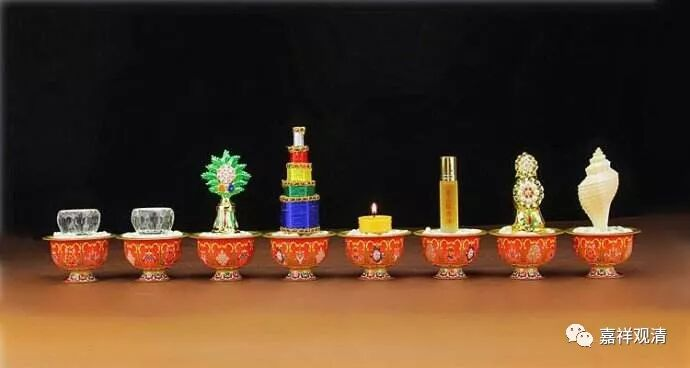

**《菩提速道》019（中）**

印度人平时是赤脚的嘛，所以当你请印度人过来家里的时候，都要给客人洗个脚，或者意思一下象征性地也要放上一盆水。所以这个“洗足水”的意思就是请佛菩萨来的时候，请他们洗脚。其实我们也没有真的将涂香涂在佛的身上嘛，但意思是说，这个就是“涂香水”，而那个是请佛菩萨喝的水，然后这是吃的，那是喝的……就是这样。

当然，佛教的传统当中是说佛走路的时候脚不沾地的，这个是我们的说法，可能是有点神话的背景。但是佛陀的脚还曾经被竹刺刺穿过呢！我们如果不要太神话地来说，佛还是在走路的嘛。足不沾地的话，干嘛还要在《金刚经》里面说“洗足已，敷座而坐”呢？再说了，足不沾地的话，佛的脚印哪来的呢？

“水、水、花、香、灯、涂、果、乐”——这个就是印度的待客之道，是吧？既然佛教是从印度传过来的，那就要按照印度的习惯来，没人敢改，谁敢改？！如果是我们中国人的习惯，就不是洗脚水了。问题是，汉人当中没有出现过龙树菩萨。假如说，在汉人中间出现了龙树菩萨，开启了南天铁塔，那就可能要供月饼了。如果是美国的龙树菩萨，恐怕就要供可乐了。这没办法的，肯定有圣地崇拜啊！圣地的祖师，有加分，而且加很多。

而且，你别看这是显宗的内容，这里面已经有密宗的背景了，是密宗下三部的背景。这里要求的供养都是非常丰富、非常好，能多好就要多好，能用金的就用金的，能用银的就用银的。（我们是不是也照着做一下？八吨红木……）理论上来说，是应该要做的——黄金的供品……也不用怕贼偷，前面不是讲了吗？因为四大天王都帮你看着呢，如果偷了就找他们：“啊？你们居然把小偷放进来？！”（不过说实话，庙里还是挺招小偷的，从功德箱到保险箱，从乡村到大城市，我都遇到过……呃，难道我是灾星？）

“水、水、花、香、灯、涂、果、乐”，就等于是印度人请客人进来，先招待洗脸水和洗脚水，然后把花环往你脖子上一套，再点支香，点个灯，喷上香水，端上各式的果品，最后把音乐奏起来。这就是印度贵族请另外一位贵族到家里的仪式。穷人就不讲究了……

