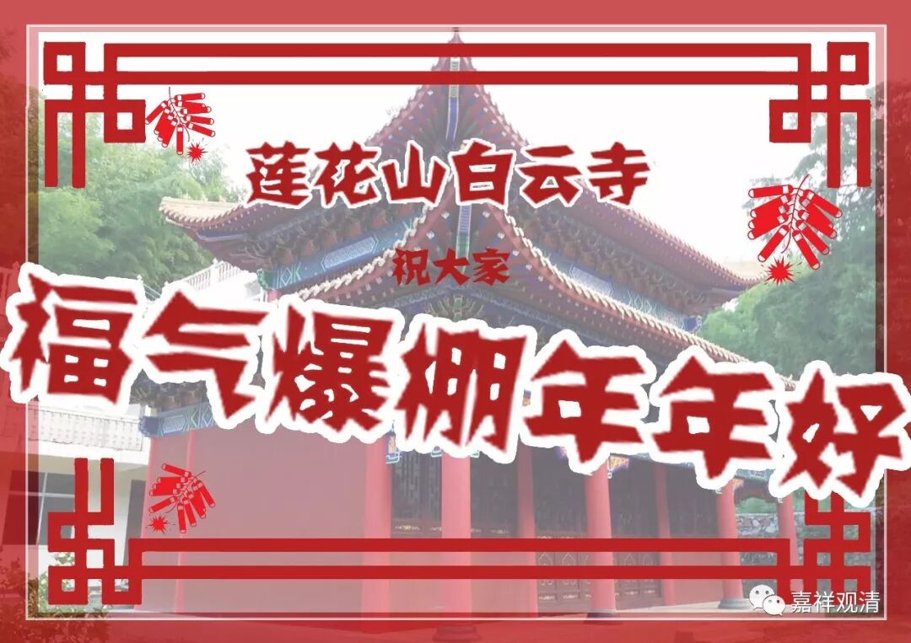
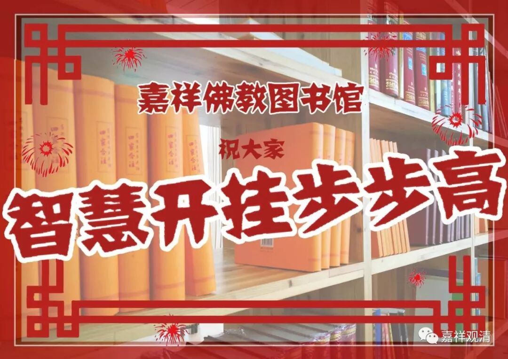

**续更啦！**

新年到了，先说拜年的话：

祝大家，二障断除，福智增长，心系解脱，速趋无上！

当然首先呢，财运、福气之前，先要身体旺旺！有了身体，学修有了增上的基础，对吧。

为什么要说到身体健康呢，因为……微信公众号有很久没更新了，后台也有很多人问（我刚看见），也有很多弟子、朋友来询……其实就是——年前生了场病，噱微有点重。开始呢，有点大意了，然后呢，中国传统医学先治了四肢厥冷，再通过现代医学调整电解质紊乱、补液、补充能量、再请俩大寺院念经……然后呢，大的问题基本解决，就是静养了。其实现在也还没算完全养好，估计还得有些时日喝点稀饭（不过最近稀饭好像喝得不多……），脾胃心肺都得慢慢养……所以呢，有段日子没更新公众号了。也是有点抱歉的，也劳大家惦念了。期间有朋友问起，我说：那就正月初一开始更新吧。也算是一个良好的开始。

所以，正月初一，我又来了！借一句话在这里用一下——“我会做好这份差事！”

