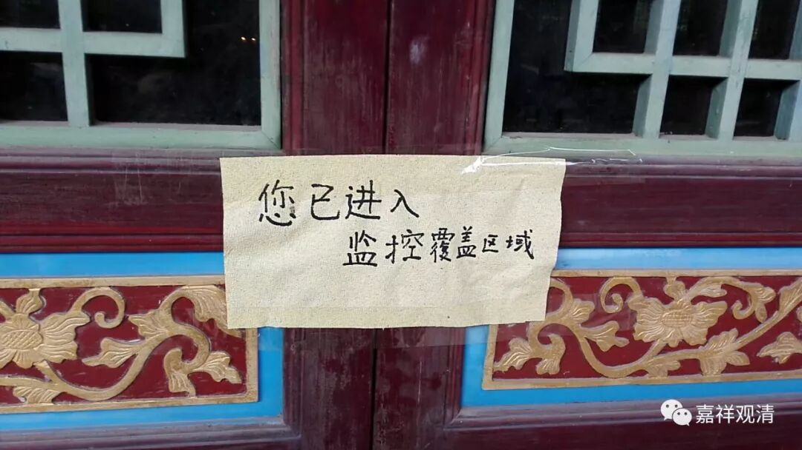
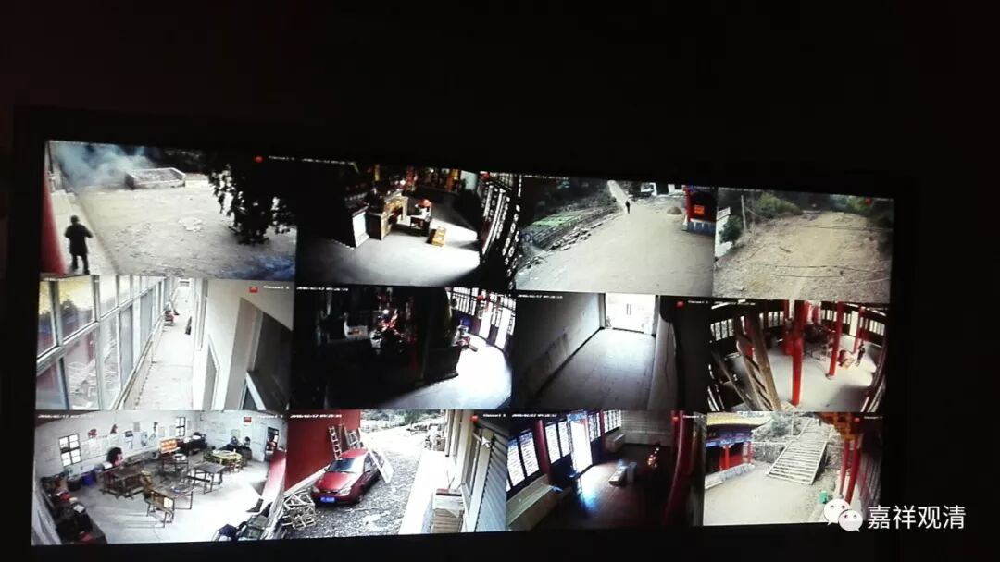

**庙里装了监控器**

庙里装了监控摄像头，很酷，一个屏幕九个画面，还可以连手机，随时监控……其实对庙里来说也是不得已。一般人不知道，庙里挺招贼的。

先说我们白云寺。

我第一年来白云寺，过年时候不了解情况，功德箱十几天都没打开，等到过了初十打开一看，基本是空的！第一年就招贼了！虽然是小庙，但春节是我们主要收入来源，初步估计，被偷了大几万。

后来又被偷了几次，有一次打开功德箱，有一个作案工具——长长的线前面绑着块小木头，粘着胶水——这是来粘大钱的。估计“作案”的时候有人经过，人家一紧张，作案工具掉进功德箱去了。（刚想到，原先我买过一个丢钱就会说话的功德箱，后来没声音了，现在想想，可能是被小偷故意弄坏的。）

还有一次，应该是晚上，大殿门都被撬了，但那天正好我们刚清理过功德箱，所以他（们）劳而无功。本着贼不走空的古训，人家顺手偷了庙里几桶香油。这次以后，我们清理功德箱就更勤快了。

后来山里居士告诉我，大约八十年代的时候，山上住着一个出家人，一个人看庙，当地有年轻人上山，把他打了，抢了五百块。八十年代，算一笔不小的数字了吧。后来有居士上来看到师父鼻青脸肿的，问情况，师父一句话都不说。但居士还是报警了……最后抢钱的人被抓了、判了刑。

今天有人说“买保险箱，卯在地上的那种”……呵呵，没用。圈里湖北某寺就有这种保险箱，晚上照样被偷走了，还好，第二天早上又在河边被发现了——小偷弄不开……

圈里很多师父都说小寺院遭贼经历……其实大寺院也遭贼。那年我在天津某寺，市区，早上七点，功德箱被偷了！那个管殿的居士就离开一会会儿。后来她在那里磕头忏悔，觉得是自己没尽到责任。呵呵，还是那句老话，不怕被贼偷，就怕被贼惦记着！

现在很多寺院都装了监控，我们现在也装上了，算是跟上了潮流！今天还有信众居士说给我们装“人脸识别抓捕系统”！哇噢，好高大上！后装也有好处，这就是后发优势：）

