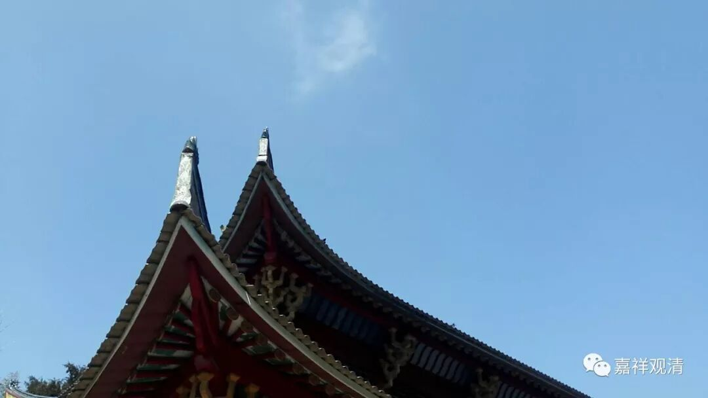

**《菩提速道》讲记020（上）**

** “戊三、如‘在舒适的垫子上，以身体八支坐姿或随自适意而坐’所说，”**这个“随自适意而坐”是有相应背景的，它绝不是“葛优躺”这样的啊！相对来说你可以调整一下，但不能过分——在座上搞个倒立是肯定不行的。就是盘腿的时候也可以稍微放轻松一点，本来八支坐是双盘腿的，如果你单盘、散盘或者其他稍微调整一下的坐姿也是可以，这个就是“适意而坐”。

** “在舒适的垫子上，身体八支坐姿的方式者，”**这个有点绕口令啊！** “如温萨巴大师说：”**往前追溯的话，温萨巴大师是作者的前二世。** “‘手足及腰三，唇齿舌为四，头眼肩气息，为毗卢八支。’”**第一个是手；第二个足其实是腿——双盘腿；第三个是腰要直；第四是唇齿舌，闭嘴，舌抵上牙龈；第五个头，不低也不抬；第六是眼，半睁半闭；第七肩要平；第八个是气息，就是数息了——这就是叫“毗卢八支”。那么，为什么称为“毗卢八支”呢？因为在密宗的系统当中，毗卢遮那佛是属于和色蕴有关的，而我们这个坐姿的样子是看得见的，是物质的样子嘛，所以称为叫“毗卢八支”。

回过来讲，供器这些东西东密倒是做得很好哦，确实会让人生起欢喜心，所以很多和尚愿意去日本，是吧？确实会让人生起欢喜心。要不我们这个流派的供具以后都按照日本来吧？可以到义乌去订，不按照以前什么一千个一做，而是三个、五个地定制。日本的法器的确做得很好啊！而且密宗的下三部确实就是对这方面很有要求的，用今天的话来讲就是对祭祀、供养的方面要求比较高，所以这些供器都非常精致。上次上博馆展出的醍醐寺的藏品都是做得很精致的。

今天国内基本上也可以做到很精致了。其实日本很多密宗的法器也是在义乌定制的，只是他们定制的数量很少，三个、五个而已。我们以后也去义乌看看，也定制一些吧，然后看要不要在这里做一百个火供。

