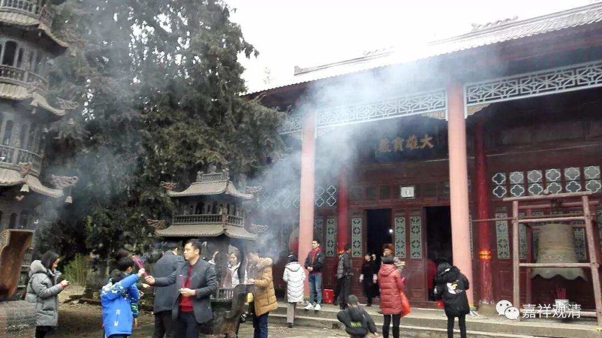
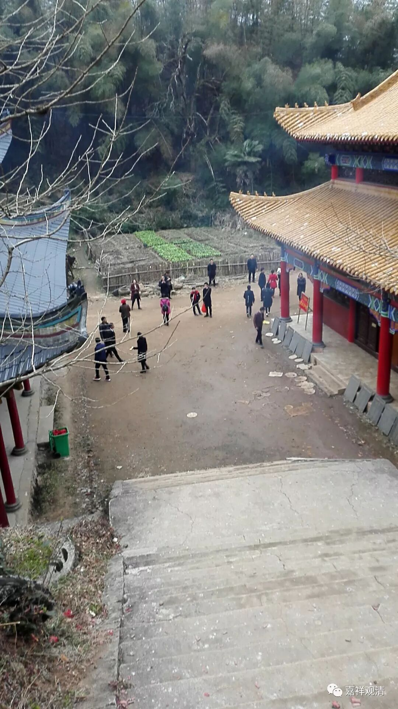
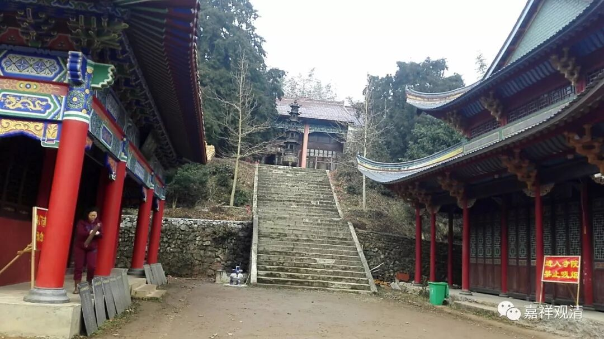

**年初三：谈谈“日新”的民间信仰**

今天大年初三，来庙里的人大约是大年初一那天的一半吧，和大城市相比那是少之又少，和自己比，那已经叫“门庭若市”了。（见上图）

（年初三）

本地信仰或者说风俗里，去寺院是“三、六、九”这样的日子人多，都不知道来由是什么，但历来如此。（有个上海朋友说：这叫“三六九，拉现钞”。呃，我觉得不像……）比如昨天初二，来人就很少，明天初四，也会很冷清（所以我约了明天下午去村里晃晃）。“三六九”，很特别，所以，我们寺院wifi密码就是369……

（上图大年初二）

后天是年初五。我刚来的时候，年初五也很少人来烧香，这两年跟着大城市的“迎财神”的风，初五也有很多人来进香了——这个“新风”才刚出现没几年，觉得会慢慢固定下来。发财，大家都不想错过！（看来我们可以搞个财神殿。现在我们有个财神洞。）

再说大年（夜）和小年（夜）。这里“小年”的日期，各村都不一样，是相互岔开的，意思很明显，大家过年的时候都可以方便地走动——在我们村过“小年”的时候，周围的亲戚朋友都可以来走动走动，因为附近其他村这天不是“小年”……这也帮助我理解了各地“小年”日子不一样的情况。（现在说各地“迎财神”的日子也有不一样了。）

民间的风俗、信仰走势就是这样很没章法，也许某个人做了一个梦就会出现一个新做法——浙江某地老太太做了一个梦如何如何，于是周围很多县乡老太太开始初一、十五守在庙里熬夜。我们寺院每年七月二十六有隔几个县的一堆人来进香，有时候打着几面旗帜就来了，听说以前还有带着赣剧团来演戏的，我倒是看到他们自己来了以后吹拉弹唱的——也不知道庙里给他们有啥特殊的感应。（兴许是咱红豆娘娘托梦。）

民间的信仰，走到民间，你会看到很多……

