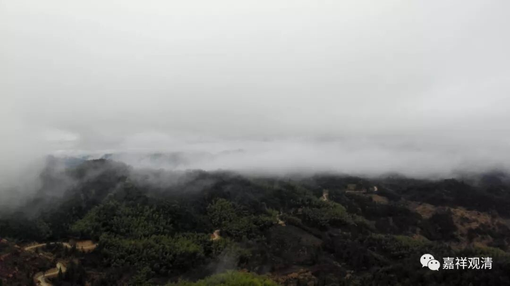
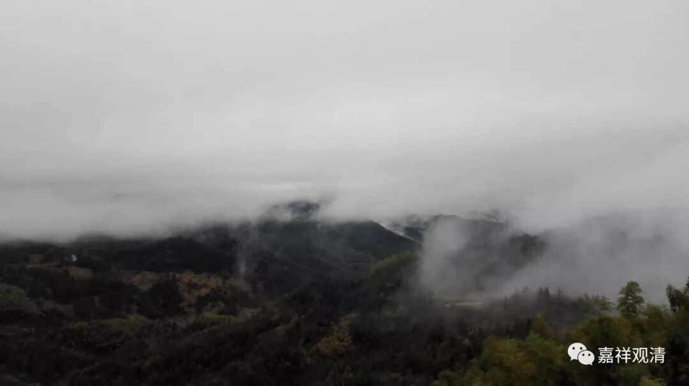
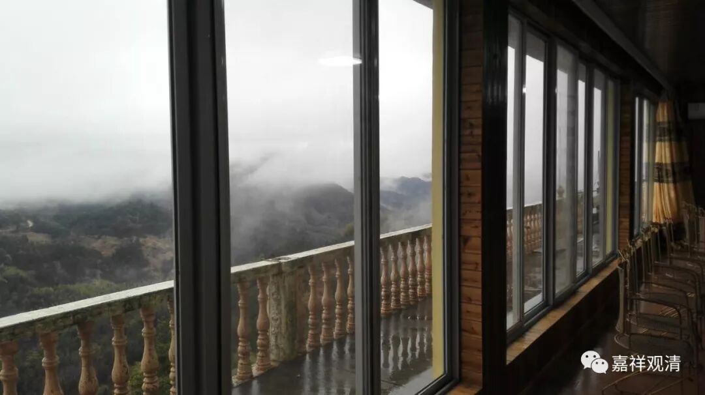

**初四，我们聊聊“虚实之间”**

今天年初四，如我所料，基本没人的样子——因为还下了雨。

但山里风景倒更有味道了，有了云，一切就不一样了。其实最好的是雨后初晴，那云海，真美！

（从窗子看出去，我在综合楼就是这样的风景）

没事，就和徒弟聊天，今天聊到了《大智度论》和佛教的“虚实之间”。

《大智度论》研读了段日子，一点点追究，还是看出了些线索。应该说，《大智度论》和很多其他佛典一样，是“层垒地造成的”（顾颉刚语）。《大智度论》里，既有很早期的传说（后期已完全不见踪影，比如“鸡足山”的位置），有和青目等早期中观论师相一致（而和后期迥然不同）的说法，也有很荒腔的传说（有错误的地理知识），也有明显是罗什的旁注……基本上可以断定，它是早期中观师们一代一代续有增添的作品，而不是一人一地的产物。

至于“虚实之间”，以前提到过佛教典籍的用词上，有“虚词实化”、“实词虚化”的现象，前者如各种“及”的解释（如解释为“‘及’字包含另两个心所”），后者如玄奘法师的“故”（玄奘法师已经喜用四句格，所以有很多地方，“故”并不是原因的意思，而是完全作为虚词来凑数字用的）。

其实“虚实”之转变，在义理上也有表现，如早期的“缘起”一词就很具体，但中观派用起来就大而化之，虚化了，范围更大了；又如“非空非海非水间”一颂，《法句经》里明显是泛指，很虚化，到了晚期《法句经》的各类解释，就演变出了一个故事——这都是时代和义理带来的“虚实转变”……如果不了解这类虚实的变化，就会对理解产生一些障碍。

……呵呵，人多，我们增点福，人少，我们添点知.今天增加点智慧，明天（年初五）增加点福报！哈哈哈哈！

