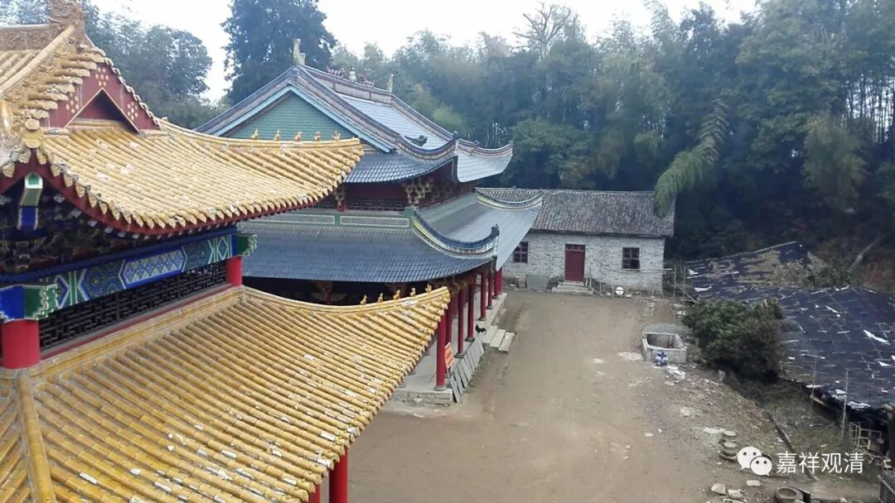

**《菩提速道》020（下）**

我们是不是也应该为后人准备点东西呢？比如说五千年以后，在白云寺的遗址还可以挖出很多好东西，而不是挖出来很多像两万年前的鸿山遗址当中的很粗糙的中国龙，我们也要留点好东西在那里，是吧？不要让后人挖了半天：“呃，队长，又挖到jk法师的光盘，和《太上感应篇讲记》”……那样太给我们这个时代丢人了！我们多印点好东西，也为这个时代挣点面子，“挖到一本书，请文字专家来读……哦，《观清全集》！哇，那个时候哲学已经这么发达了吗？”“又挖到几尊琉璃像……还有尼泊尔铜像”……那就变成莲花山遗址、白云寺地宫了，哈哈。

** “（一）依大师所说，在前面的安乐座上，”**这个“前面的安乐座”就是前面所讲的比较舒适的座位上，你就去打坐了，** “脚**（实际上是腿）** 以金刚跏趺或半跏趺坐均可。”**其实散盘也不是不可以。** “半跏趺的方式，是指左脚在内，右脚置外，把左脚跟放在靠近密处的地方，左脚面不要被压在右大腿下面，或被挤在右大腿内侧。”**

** **

打坐呢，有很多坐姿，这只是其中一种。如果你练过瑜伽就知道了，有很多的坐姿，这是其中的一种训练方法。还是像刚才所讲的，双盘得严格一点或者不严格、单盘得严格一点或者不严格都可以，这只是其中的一种。你完全按照这个做当然可以，你不按照这个做，只要是相类似的单盘、双盘，都可以。盘腿，其实最好是童子功，长大了再拉韧带，和童子功还是差很远了。

** “（二）双手结等持印，”**“等持印”就是定印，就是我们通常所讲的：右手放在左手上，大拇指轻轻相触。** “置于脐下四指处，”“脐下四指”，**这不就是我们中国人讲的丹田附近吗？这是关元还是气海？这个很有趣，古时候少林寺对此有辩论的，就是丹田到底在什么地方，是在神阙呢，关元呢还是气海呢，肚脐呢，还是脐下三寸（四指就是三寸）。结果他们都成功了，都可以，全都是少林寺的高僧。** “右手在上，左手在下，二拇指尖稍稍相触，”**稍稍地碰上就可以了。** “这对于气脉的运行有着特殊的缘起。”**

** **

在西藏有这个说法，我估计以后再有人写的时候，也都是说“对气脉的运行有着特殊的缘起”，我以前所学的也是这么说。但是你一个手放在那里，不也是可以的吗？你一个手这样放、另一个手那样放，不也是可以的吗？这样也是可以的吧？那气脉的运行呢？反正有“特殊的缘起”，如何“特殊”我们也是不知道的。也就是说，这是一种定式，按照这个来就可以了。我们也不要打破这个定式去自创一个，没有必要。

