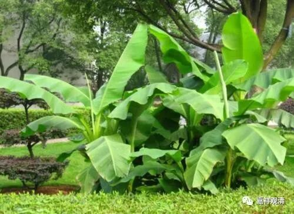
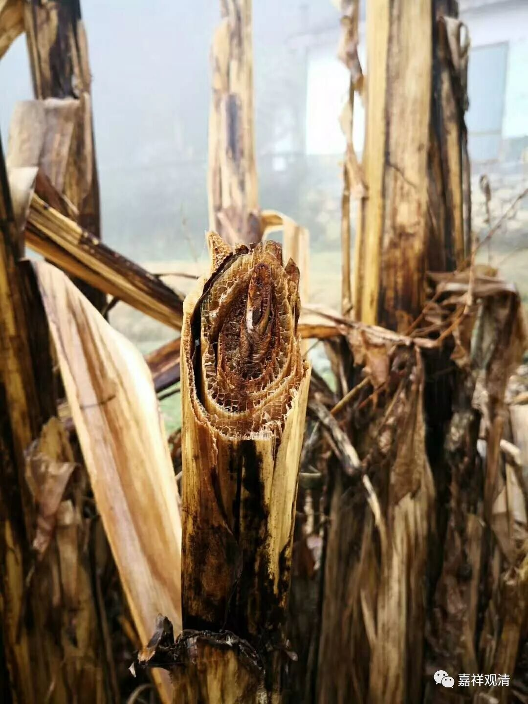

**芭蕉树无实**

上图就是芭蕉树，常见，下图是它被劈开的样子。层层剥开，无有中实。所以佛经常用芭蕉树来打比方，比喻无有实体。

《阿含经》中常见此喻。如《中阿含经》卷五十六：

“犹去村不远，有大芭蕉，若人持斧破芭蕉树，破作片，破为十分，或作百分。破为十分，或作百分已，便擗叶叶，不见彼节，况复实耶？阿难！如是比丘若有所觉，或乐或苦，或不苦不乐，彼观此觉无常，观兴衰、观无欲、观灭、观断、观舍。彼如是观此觉无常，观兴衰、观无欲、观灭、观断、观舍已，便不受此世，不受此世已，便不恐怖，因不恐怖已，便般涅槃，生已尽，梵行已立，所作已办，不更受有，知如真。”

《杂阿含经》卷五：

“如是，火种居士！身婴众苦，常与苦俱，彼苦不断、不舍，不得乐也。火种居士！譬如士夫持斧入山，求坚实材。见芭蕉树洪大直，即断其根叶，剽剥其皮，乃至穷尽，都无坚实。火种居士！汝亦如是，自立论端。我今善求真实之义，都无坚实，如芭蕉树也，而于此众中敢有所说。我不见沙门、婆罗门中，所知、所见能与如来、应、等正觉所知、所见共论议，不摧伏者。而便自说：‘我论议风，偃草折树，能破金石，调伏龙象，要能令彼额津腋汗，毛孔水流。’汝今自论己义而不自立，先所夸说能伏彼相，今尽自取，而不能动如来一毛。”

《杂阿含经》卷十：

“尔时，世尊欲重宣此义，而说偈言：

‘观色如聚沫，受如水上泡，

　想如春时燄，诸行如芭蕉，

　诸识法如幻，日种姓尊说。’”

《增一阿含》卷二十七：

“多耆奢白佛言：‘色者无牢，亦不坚固，不可覩见，幻伪不真；痛（受）者无牢，亦不坚固，亦如水上泡，幻伪不真；想者无牢，亦不坚固，幻伪不真，亦如野马；行亦无牢，亦不坚固，亦如芭蕉之树，而无有实；识者无牢，亦不坚固，幻伪不真。’重白佛言：‘此五盛阴无牢，亦不坚固，幻伪不真。’

是时，尊者多耆奢便说此偈：

‘色如聚沫，痛（受）如浮泡，想如野马，行如芭蕉，

　识为幻法，最胜所说。思惟此已，尽观诸行，

　皆悉空寂，无有真正，皆由此身，善逝所说。

　当灭三法，见色不净，此身如是，幻伪不真，

　此名害法，五阴不牢，已解不真，今还上迹。’”

类似的地方还有很多。（最后两篇，应该是同源的经典。）

《杂阿含经》的“观色如聚沫，受如水上泡，想如春时燄，诸行如芭蕉，诸识法如幻，日种姓尊说”一颂，后来最为常见，如《大般若经》卷三百五：

“佛言：‘善现！若菩萨摩诃萨安住静虑波罗蜜多修学安忍，观色如聚沫，观受如浮泡，观想如阳焰，观行如芭蕉，观识如幻事……’”

又见于晋译《华严经》：卷四十三：

“观色如聚沫，受如水上泡，

　想如春时焰，众行如芭蕉。

　心如工幻师，示现种种事，”

龙树《中观宝鬘论·杂品》也用了“芭蕉”的比喻，“如剥芭蕉树，无余尽无实；从六界寻思，士夫亦如是”——可以看出，它直接脱自《阿含》。

中国人最记得的有一个颂子：“身似菩提树，心如明镜台……”，这里的“菩提树”，陈寅恪先生认为当是“芭蕉树”，以比喻身无坚实——而这是佛经中常见的比喻。余深以为然！

