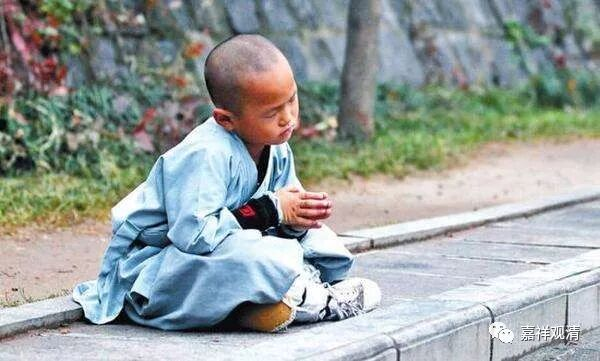

**《菩提速道》讲记021（上）**

** “（三）腰应当伸直，脖颈略向内勾。”**“向内勾”其实就是向下类似微微点头那样的意思。“腰应当伸直”，其实真正坐的时候腰有时也是塌的。你去看西藏的或者是南传的打坐的姿势，很多照片上都是躬着背的。当然不是说要弯得这样厉害，而是坐着坐着就会慢慢软下来。其实坐一会儿之后，你就观察一下自己，再调整一个舒适的姿势。长时间这样也不舒服的嘛，再调整一下姿势就行了，有时太直了也很累的嘛。

其实这也有点像中道一样，太极拳里面经常讲“松而不垮”，是吧？你不能垮掉了，那不像话。而你太直了，其实也挺累的嘛。一直这样坐的话，结束之后你的腰背很酸的，那时真想马上找人推拿一下。你们看到日本和尚在电影里面都是背很直的，那是因为有摄像机。如果有摄像机对着我的时候，我也是坐得很直……

** “（四）齿唇自然放松，舌尖微抵上腭。”**牙齿不要咬合上，而是刚刚张开一点点的样子，舌尖要抵上牙龈。

** “（五）头勿偏斜，正直而住。”**头不要歪。有时候会有点累的，我看到很多人打坐时间长了以后，头就抬起来了。在打坐稍微过一段时间的时候，你不仅要调整你的心，也要调整身体的。自己感觉头慢慢抬起来了，就稍微低下来一点，不要再扬起来。

** “（六）眼视鼻尖。”**“眼视鼻尖”是大概地去想，不是真的用眼睛去看，否则就变成斗鸡眼了。“眼视鼻尖”就有点“用心去看”的意思，眼视的方向是鼻尖的这个方向，真正所谓的“视”是意识往这个方向去关注的样子。

** “（七）双肩平舒。”**肩平，一高一低也不行，要平。太极拳、站桩都要求沉肩坠肘，就是这个感觉，肩，要向地找，不要抬肩。

** “（八）气息均匀舒缓，如此合为八支。”**前面七个为七支，加上这个“气息”为“八支”。就是数息。“均匀”，指这时的呼吸不是一头细一头粗。比如你刚刚跑完步就打坐的话，气息就是很粗的这种。现在你要放细，要“舒缓”、要均匀。这样就是“八支”了。

