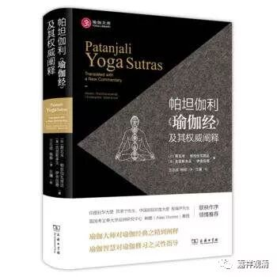

**略说《瑜伽经》的“八支”**

谈到佛教禅修的“毗卢八支”，最近正好在看印度宗教的内容，看到印度帕坦加利的《瑜伽经》里，也有瑜伽“八支”的说法，和佛教“毗卢八支”不同，可以在这里给大家简单介绍一下。

帕坦加利《瑜伽经》的八支是：禁制（持戒）、劝制（精进）、坐法、调息、制感、执持（专注）、静虑（冥想）、等持（三摩地）。

这八支，后后建立在前前之上，是次序的八支。

一，持戒（戒禁、禁制）有五：1、不杀生（不害）；2、诚实（不妄语）；3、不偷盗；4梵行（不淫）；5、不贪（不贪恋财物、不收礼）。后期又加五条：1、慈悲；2、正直；3、耐心；4、坚定；5、节食。

二，精进（劝制）也有五：1、清净；2、满足；3、苦行；4、学习与诵读；5、敬神。和佛教一样，读诵和说法、研习经论是放在一起的。

三、坐法。如果说“毗卢七支”的话，略相当于这里的“坐法”。

四、调息。第三和第四加起来，大致同于佛教“毗卢八支”的内容。

五、制感。指控制感觉器官，即感官不向外驰求。

六、执持（专注）。专注于一定的内容上。

七、静虑（冥想）。长时间专注达到的状态。

八、等持（三摩地）：粗显的活动和意识伏灭后，便达到三摩地的状态。

此中，前五属于外支，属于外在的准备活动，后三属于“内支”，是瑜伽的核心部分，所以又称为“专念”（“总制”）。而后三支也只是“无想三摩地”（无种三昧）的前行。

简单的谈谈《瑜伽经》的八支，算是了解一下印度其他宗教和禅定相关的一些内容。以后有机会再谈……

