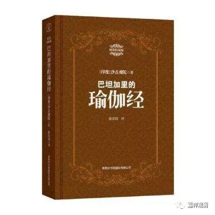
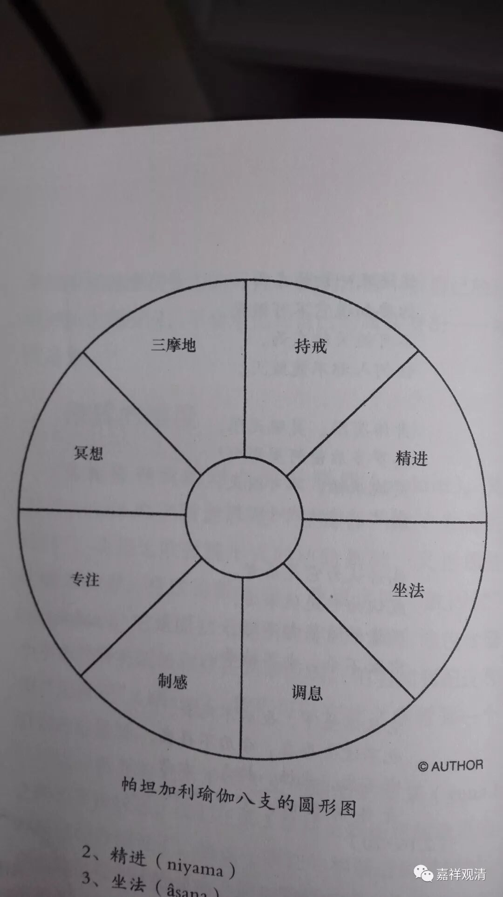
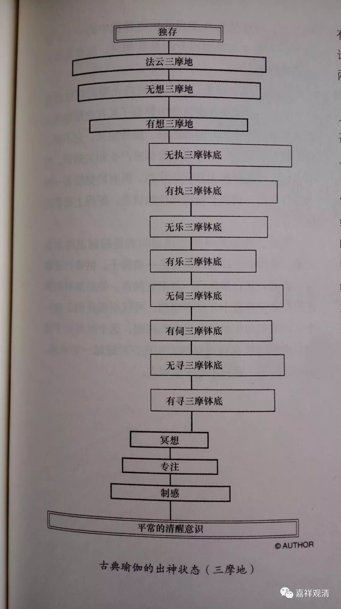

**《瑜伽经》“三摩地”和佛教的“四禅八定”**

昨天仓促之间，有几个插图没法，现在补上。插图来自【德】格奥尔格·福伊尔施泰因的《瑜伽之书》。

顺便抱怨几句。此书是多杰老师推荐的。应该说，原著确实不错，但是翻译得实在让人痛苦，如翻译“三摩地”译作“出神”，昨天巴登师说，翻译真是垃圾，起码应该是‘巴丹’而不是‘帕坦’。看来翻译应该不懂梵文，他是按照英文来读的。

接着谈《瑜伽经》和其注释里提到的三摩地。

《瑜伽经》和其注释里，出现了这样一种禅修的进阶，我们看一下。

独存

↑

法云三摩地

↑

无想三摩地

↑

有想三摩地

↑

无执三摩地

↑

有执着三摩地

↑

无乐三摩地

↑

有乐三摩地

↑

无伺三摩地

↑

有伺三摩地

↑

无寻三摩地

↑

有寻三摩地

↑

冥想

“三摩地”，《瑜伽经》里首先分“有想三摩地”和“无想三摩地”，其上有“法云三摩地”。有想三摩地又分出很多，有寻三摩地，无寻三摩地、有伺三摩地、无伺三摩地。（这里，很像佛教讲的“有寻有伺”等三，但似乎《瑜伽经》这里算作四种，而不是在“无寻三摩地”里分出“有伺三摩地”和“无伺三摩地”。）

据对《瑜伽经》后期的解释，又出现了其上的四种三摩地：有乐三摩地、无乐三摩地、有执三摩地、无执三摩地。但这是后期的解释，我很怀疑，这种解读是受到佛教四禅八定说的影响改头换面出现的。

我们看一下佛教常说的四禅八定，其从上往下的次序依次是：

非想非非想定

↑

无所有处定

↑

识无边处定

↑

空无边处定

↑

舍念清净定

↑

离喜得乐定

↑

定生喜乐定

↑

离生喜乐定

很接近吧。

