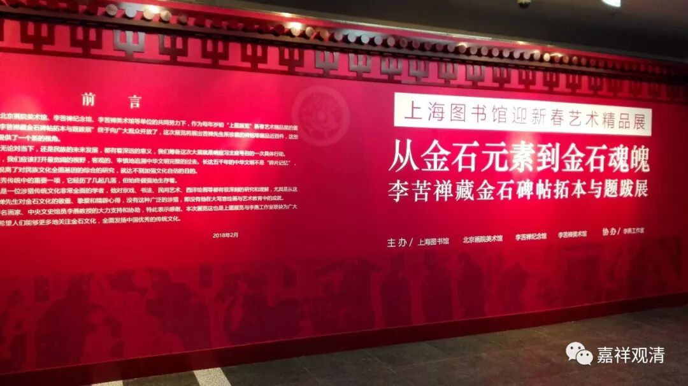

**回首又见他——文殊般若碑**

今天去医院做检查，回来路过上海图书馆，正好看到上海图书馆有李苦禅收藏金石拓本展，便进去参观参观（想去看的人注意了，本月28号下午15：30展览结束）。

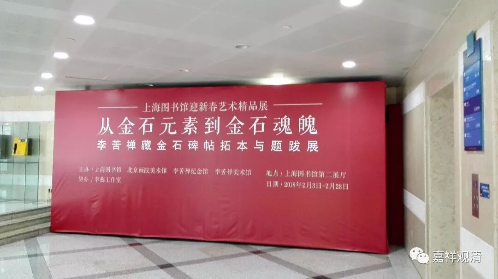

书法这方面我是外行，比较感兴趣的是金石碑帖里包含的宗教和历史题材部分。作为中国文化重要部分，存碑的拓本里这方面的资料自然非常丰富。在这个展览里也一样，儒学、历史方面的材料很多，道教的碑拓也有不少，佛教方面的内容也有很多……

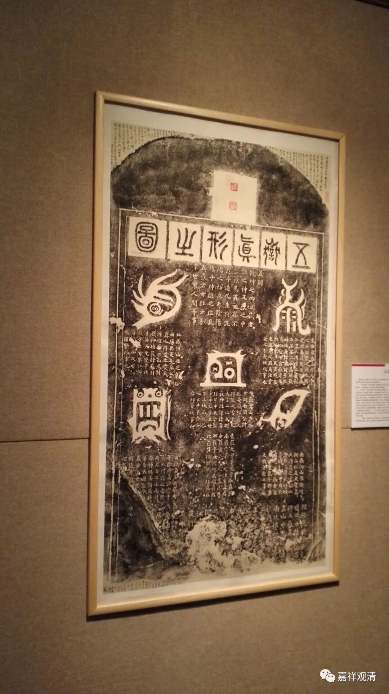

（道教·五岳真形图）

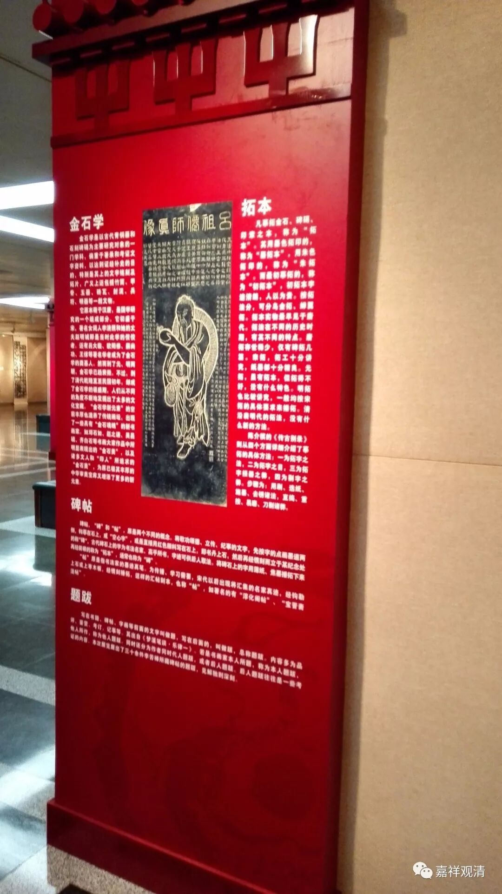

（道教·吕祖仙师真像）

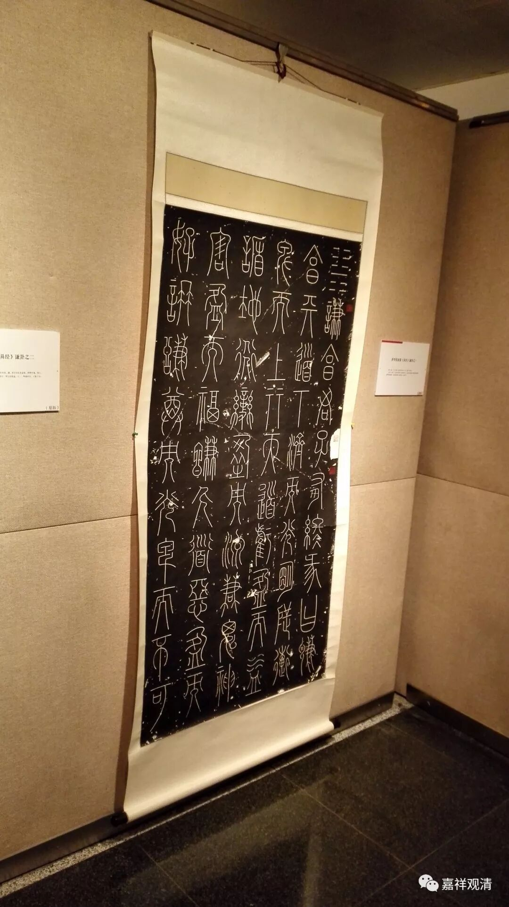

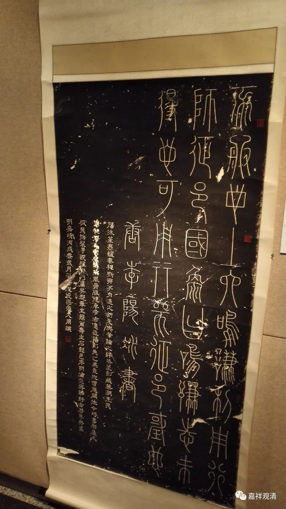

（唐·李阳冰篆·谦卦）

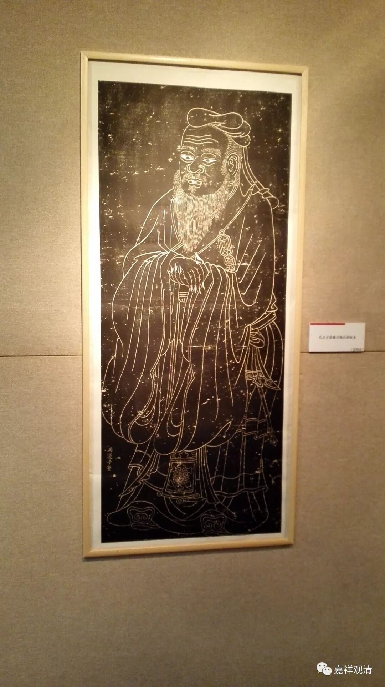

孔子像

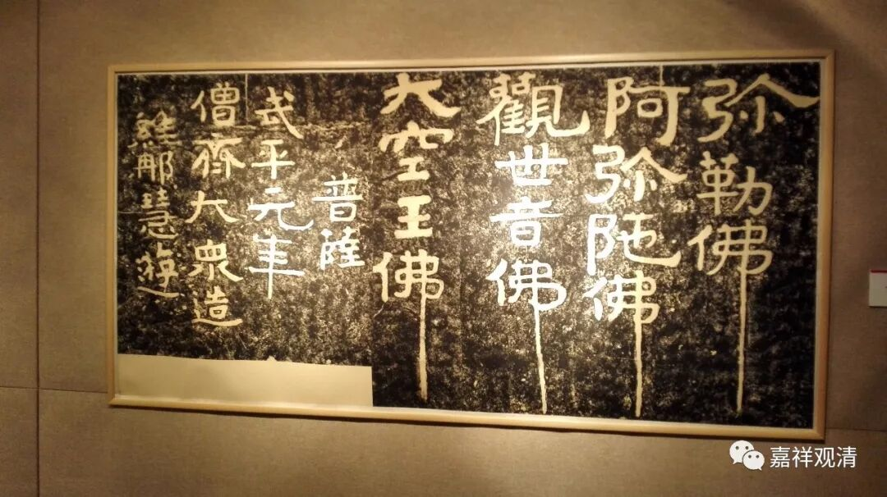

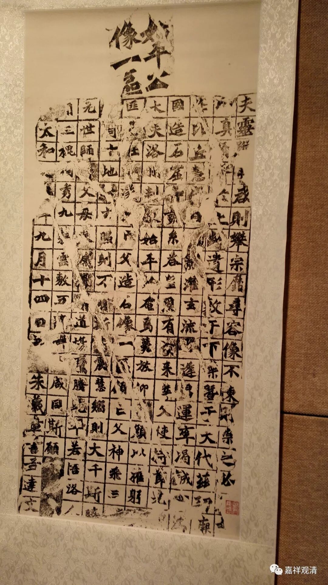

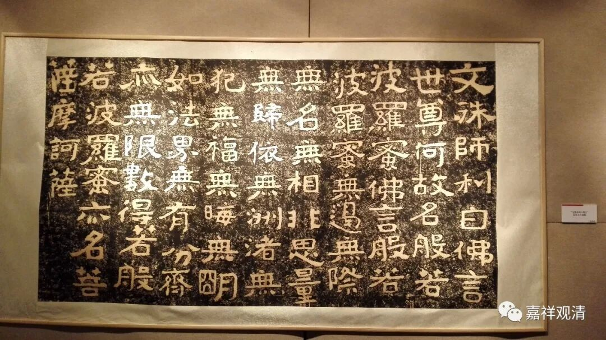

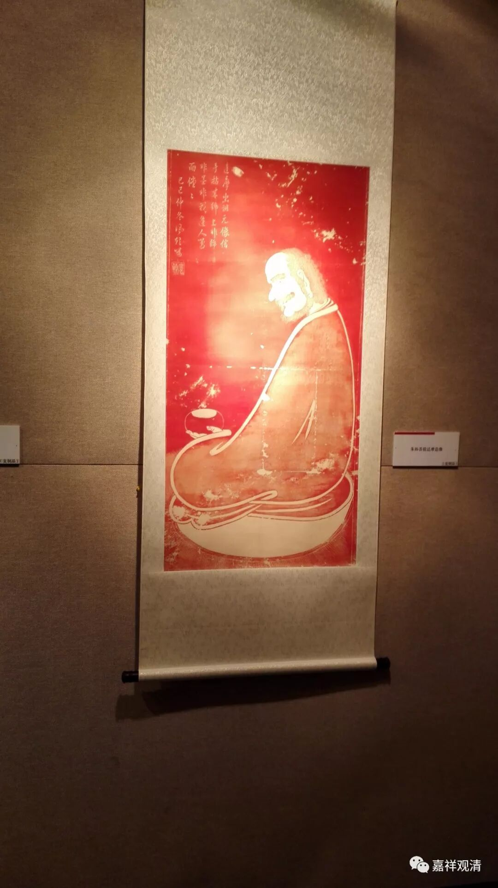

（以上佛教之部分）

佛教碑拓里，这一幅引起我的注意——我们刚见过面！

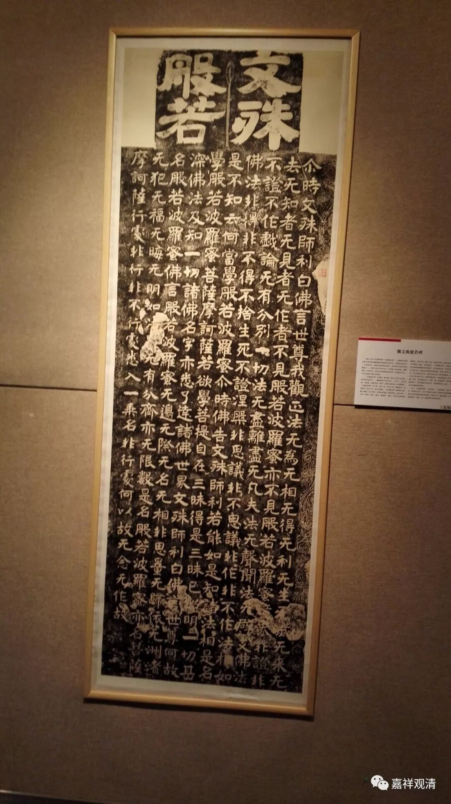

这是《文殊般若碑》，是魏碑里很有名的一个代表，代表了从隶书向楷书的过渡时期，是一个承前启后的珍贵文物、史料。据说颜真卿求得此帖，如获至宝，对颜氏书法风格的形成有很大的影响。

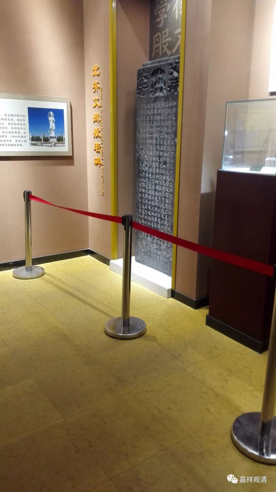

此碑原立于水牛山之巅，现藏山东·汶上县博物馆。上个月去山东汶上参拜宝相寺佛舍利时，在汶上县博物馆见到过原碑。博物馆就在宝相寺正前放几百米处。上面这块是我偷拍（不好意思）的《文殊般若》原碑。（我发现，拿到好的拓本、看过原来实物，对碑文、书法的理解会不一样——和他们相比，单纯地那种出版的拓本感觉略失一贯的气、骨。）

展览和汶上县博物馆里对此碑的年代稍有分歧，汶上县博物馆作“齐·文殊般若碑”，展览做“魏·文殊般若碑”，时代差别不大，但毕竟不同，不知此中何者更有论据支撑，当更细考之……

