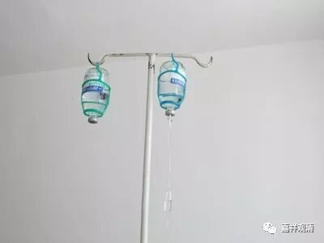

**偏执狂们可以歇歇了**

“学佛”的人群里，有很多奇怪的国学粉和中医粉，他们常常也具备一定的知识水平，但并不是专业人士，却常常比我们这些内行更狂热地鼓吹中医、国学、佛教，甚至在我们做解释的时候，自high地把我们骂个狗血喷头，却又匍匐于垃圾大师们的脚下。也许他们就是佛教里所谓的“一阐提”吧！

昨天看到一篇文章，点击、转发量极大，详说自己怎么拒绝了医生的种种建议而仅仅用13块钱的中药便把住院的70岁老妈救过来的“医案”。呵呵，我还没看完就想说：“你妈命真大，没被你折腾死！”这些医盲“中医粉”，实在是应该先去看看心理医生——你们其实得了“中医偏执狂”！凭几篇微信文章就否决主任医生们理论加实践来的诊断和治疗，你们真是心大！（我有一个师父，就被这样的偏执狂徒弟给硬生生地折腾死了……唉！）

作为中医大的毕业生，多少有点发言权吧。别人不谈，就拿我自己做例子吧。

前些日子生病，病得不轻，中西医一路治疗过来，正好在这儿聊聊。……由于发病时在十八线小镇，最初诊断、治疗都被耽误了，病见加重时回到上海……我直接从回到上海谈起。由于我自己是医学院出生，病后，三个中医内科副主任来“会诊”，开了四逆汤，第二天四肢厥冷症状消失，但腹泻等症状没解决。此时，传统中医的局限突出了——给药途径太局限。而且，连续的水样便一定有电解质紊乱等情况，这是口服给药不能很快解决的！于是果断去医院输液——此时，输液是最适当地举措了。在四位中医主任、副主任医师的指导下，两天里补充了3500毫升水和葡萄糖、3克钾（血钾已低于正常值）、抗生素等，病情很快便得到改善。而此后，盗汗、心慌、气喘等情况（心电图正常）又再交给中医继续治疗……我们也因此感叹：中西医各有所长，不可偏废。

其实，沿用中医、西医的说法已经有时代的局限性，大略可以理解为“中国传统医学”和“现代医学”，而这两者并不是相违的。那些网上吵得不亦乐乎的两派“精英”们，他们难道不知道他们的逻辑出发点一开始就是错误的吗？传统医学和现代医学不是“互绝相违”、不是“非此即彼”的。抗生素、输液的伟大，是那些中医偏执狂所不能理解的！可以这么说，假如没有这一百年来现代医学的进步，今天单纯的流感，就会出现令人不可接受的死亡数字！

人微言轻地写点感受，不指望“中医死忠粉”、“中医无用论”者们能改变，但希望大家能少些偏执，理性地看待“传统与现代”的结合。

