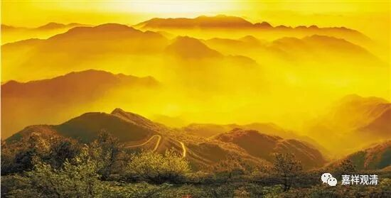

**每日一偈（2018、1）**

2018.1月份

新年快乐，

六时吉祥！

障碍尽除，

功德增长！

昨日入城市，归来泪满巾。

遍身念珠者，不是敬信人。

宝剑锋从磨砺出

梅花香自苦寒来

不经一番寒彻骨

我们个个是六祖

——赠无明佛教徒

依教出禅，随文瑜伽；

出世功德，唯系止观。

认识自己

也需要走入人群

就像没有参照

就找不到自己的位置

带些侠义气交友，

存点老实心做人。

分别因缘果，出诸法实相；

如从世俗谛，出第一义谛。

财力势能慧，是皆不可恃；

世所有非常，终结者现观。

缄默诤论少，缩头寒风小；

业海多浊浪，功德当隐藏。

身重能压秤，北风刮不走；

积学增修行，世间难引夺。

世间之法，必趋坏灭；

出世之善，辗转增上。

大雪增山色，而掩诸灾患；

“覆”能遮己过，然添诸热恼。

痛定思痛因，此痛引安乐；

受苦断苦因，此苦生自在。

事实胜于雄辩，

谣言止于知者；

纸上得来终觉浅，

真知只在躬行时……

若论出家事，

原为得解脱；

今虽未能至，

已少得出离。

愚者自知愚，彼即为智人；

愚人自谓智，实称真愚夫。

——《法句经》

龙树之幢，

赖汝来斯，

如莲出水，

如山巍巍。

——敬礼罗什

若苦能引乐，为乐故积集；

若苦唯引苦，苦故当捐弃！

若论向上事，非蹙尔而成；

故当取正道，渐渐小小行。

今多功利者，恨不朝夕成，

如人思暴富，元是不踏实。

在山泉水清，

出山泉水浊；

故欲心远离，

或先身远离。

