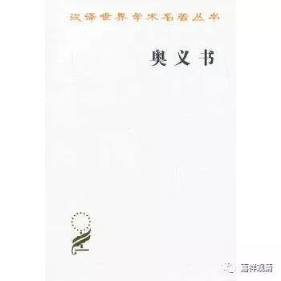

**《曼达拉梵书奥义书》的“八支”**

上次谈到“八支”，佛教里说的的“毗卢八支”是：“手足及腰三，唇齿舌为四，头眼肩气息，为毗卢八支。”第一个是手；第二个足其实是腿——双盘腿；第三个是腰要直；第四是唇齿舌，闭嘴，舌抵上牙龈；第五个头，不低也不抬；第六是眼，半睁半闭；第七肩要平；第八个是气息，就是数息了——这就是叫“毗卢八支”。相对于印度《瑜伽经》和《曼达拉梵书奥义书》来说，“毗卢八支”全部属于“外支”。

巴丹加利《瑜伽经》的八支是：禁制（持戒）、劝制（精进）、坐法、调息、制感、执持（专注）、静虑（冥想）、等持（三摩地）。前五属于外支，后三属于内支。其“持戒”，略相当于佛教的五戒，其中“饮酒”改为“戒贪”……

《曼达拉梵书奥义书》中也有八支，大支与《瑜伽经》一致，而解说有异。

《曼达拉梵书奥义书》中的第一“持戒”支，包含了四个部分的内容：1、始终控制冷热和睡眠；2、平静；3、心意稳定；4、约束对客体的感觉。

第二支“精进”，包含九个内容：1、虔信师长；2、坚持通往真理之路；3、享受愉悦经历中认识的真实；4、满足；5、不执；6、独居；7、停止精神活动；8、对行动的结果不执；9、无情（弃绝欲望）。

第三支“体位控制”，即《瑜伽经》之“坐法”，指能长久保持的舒适体位。

第四支“调息”，即吸气、住气和呼气。这里谈到了分别持续16、64、32拍，即“吸气、住气、呼气”三者之比为1：4：2.

第五支“制感”，指控制心趋向感觉目标（令心趣境？）。

第六支“专注”，指“使意识稳定于超验意识中”。

第七支“静虑”，指注意力向隐藏在众生中的超验意识单向流动。

第八支“三摩地”，是一种静虑中的遗忘态——我的感觉消失，留下绝对的存在-意识-大乐。此“大乐”中有光明。

《曼达拉梵书奥义书》这里提到的“八支”，我们可以分辨一下……

