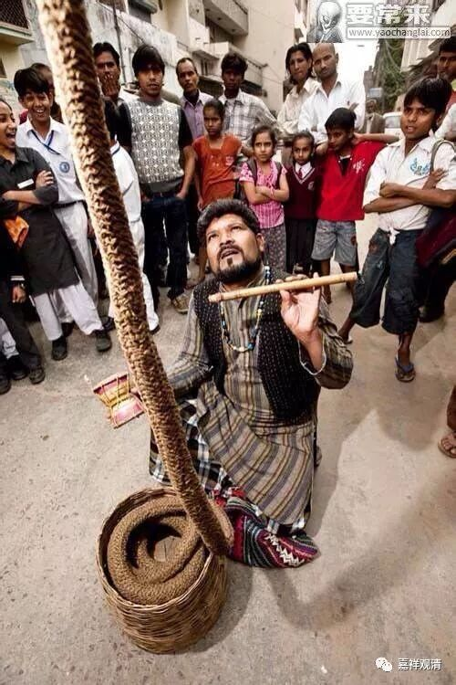
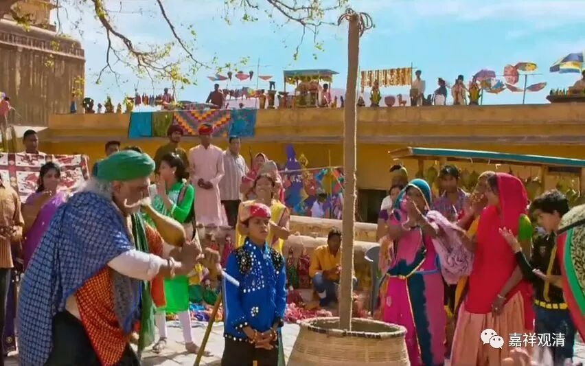
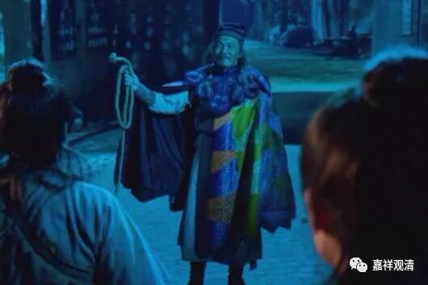
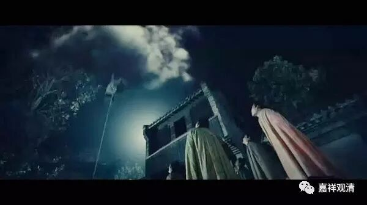
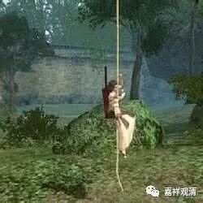

**“神仙索”的文献背景与佛教解读**

印度有一个魔术，叫“通天绳”或者称为“神仙索”，非常有名，据“研究”说是一种集体催眠术。成龙的《功夫瑜伽》里也给了一种解读。

前几年《剑雨》中也见到这种“神仙索”。

通天绳魔术中（中国以前也有），会有一个小孩沿着绳子爬上去，然后（观众被暗示）被天神大卸八块扔下来……最后由化零为整，小孩复活，观众和表演者皆大欢喜。魔术，有其套路和表演，但据说，这“肢解”背后有哲学、宗教的含义。

《慧剑奥义书》中，出现了以瑜伽切断束缚而臻永生的文句。

《慧剑奥义书》：

** “……如镫灺时，燃尽则灭矣；如是，瑜伽师焚尽一切业，乃入乎寂灭。”**（《剑雨》中的神仙索表演里就有“火”出现，施术者“火”后不见踪影……）

** “明瑜伽者，以制气与持音，磨砺此剑，使之锋颖，以无欲为硎；割断缠结，则离系缚，而臻于永生。是若其欲念皆解除，一切愿望皆解，割断缠结，斯离系缚；割断缠结，斯离系缚矣。”**

“通天绳”表演时，绳子在小孩消失后是被割断的，此后小孩复活，和这里的“割断缠结，则离系缚，而臻于永生”似乎很有关联。

以佛教来处理这段文字的话，“割断缠结则离系缚，而臻于永生”，是指断除烦恼，则离世间系缚而得解脱。若以密教（这里不是指佛教密宗）而言，恐怕要解释为解开脉结吧……

