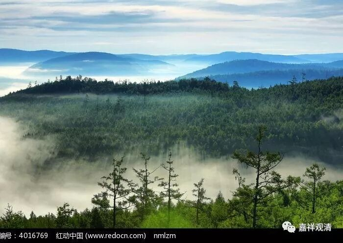

**《菩提速道》024（中）**

我们接下去看。** “修习皈依的情况：观想在自己面前的虚空之中，八大狮子擎举着高广的宝座，”**八个狮子举着又高又广的宝座。这个就是上师供的教授，他是指四个面，每一面有两个狮子擎举着高广宝座。如果没有这类引导教授的话，按照我的想法，八格狮子嘛，应该是四个角各一个，再加上四条边各一个，不是很好吗？按照这个想法，每一面看过去应该可以看到三个，这样很稳定嘛。不过按照引导的教授来说，应该是一面两个，我的想法不算，属于乱想的。

** “其中种种莲花日月轮垫上，”**“种种”是指莲花的各种颜色。在莲花的下面是日轮，上面是月轮，或者是下面是月轮，上面是日轮，也可以的。就好像是下面一本书，上面一本书这样。西藏的日轮是红黄色的，月轮是白色的。** “端坐着释迦牟尼佛，”**上面端坐着一尊佛。** “体性则是自己的根本上师，”**“体性”是什么意思呢？就相当于我的师父化妆成释迦牟尼佛的样子坐在上面，像演员那样扮成的。** “身紫磨金色，”**身体的颜色是非常健康的古铜色（刚刚在外面晒过，是吧？）。** “头具顶髻，”**就是头的中央突出来一块。

我有个师父也曾经开玩笑地问过这个问题：“怎么‘具顶髻’了呢？修破瓦法的话，不是应该中间凹进去一块吗？”我有个兄弟，在学了破瓦法以后就问他的师父：“师父，我们这个顶如果开了以后，洗澡和游泳的时候怎么办？会不会存水？脑袋会不会进水？”他想的有点多。

** “一面二手，”**释迦牟尼佛是一面二手的。我们一般会觉得这个好像不用说，但是对西藏人来说这个是需要讲的，因为藏地有很多八面六臂啊、四面八臂啊等等的形象，所以一定要讲清楚，是一个脸两个手。

** “右手镇地，”**右手就顺着右膝垂下去，指着地。** “左手等持，”**左手就是定印，（做手势）等持是这个样子的。我呢，双手没过膝啊，这个脚也歪掉了，刘备的话肯定没问题啊。所以我一直在想，所谓的双手过膝是不是实际上只是坐着的时候双手过膝呢？要不然就像长臂猿一样了。我们其实是从类人猿，而不是从长臂猿进化的嘛，手没那么长嘛。

那么这里描述的是什么形象呢？是成佛的时候的那个形象，我们现在就把这个形象相对固定下来。当时成佛的时候，谁能证明啊？佛说：“大地能证明，大地证明我成佛了。”我也觉得奇怪啊：“难道还有一个比佛还厉害的吗？证明成佛还需要大地来证明吗？”实际上佛的意思是说：他在这个世界已经无数次修行，这个世界上没有一个地方是他没有修行过的，所以说大地来证明。并不是说，真的要让地神来证明他成佛了，要不然这个地神的修行是比佛更高了……

