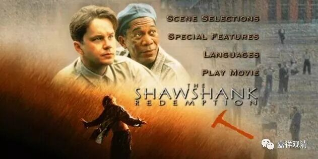
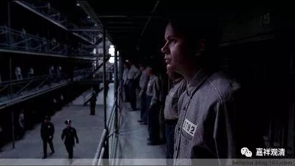
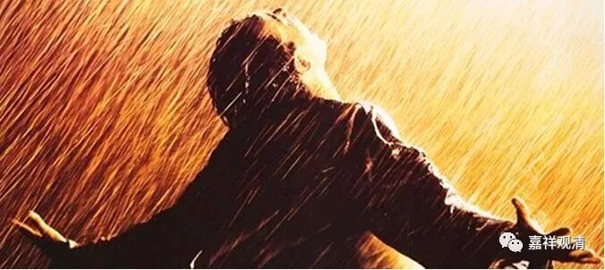
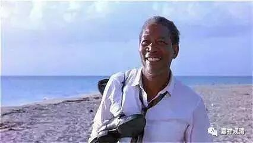

**《肖申克的救赎》就是解脱的榜样**

早上转发了杨帆的一篇文章《由一场亲子游戏引发的教育思考》，看了，有点想法。

“基因是一种复制，

生活是又一种复制。

不管你愿不愿意，

你正在成为他或她（们）……

轮回是苦！

苦于不知是苦，

苦在无法挣脱……”

杨帆后来写了段东西给我，我在这里一并推荐大家阅读：

“师父好！这段时间特别有感触。这几天经由一些家庭模式和教育现象，对轮回的苦又加深了认识。发现亲子之间的模式复制程度远远超过想象，令人震惊、恐惧。无需说什么前生后世，这一世的生命就是不断的重复轮回，从爷爷到孙子，也许生命存在的目的就是为了复制繁洐自己的基因。人就像病毒一样，以家庭为单位，不停的在传染复制。轮回苦甚，爱如刀上蜜。从轮回的角度，人们对亲情母爱的歌颂是可笑的，这些爱不过是为了基因复制、生命繁衍的手段，给一点甜头快乐让人可以继续在苦海中沉沦，以实现基因传递的＂目的＂。常有人问：如果大家都去学佛出家或不婚，将来人类灭绝怎么办？还有人说不结婚不生孩子是不负责任的表现。请问：如果现在我们呆在一个大监狱里，你会担心因为你不生孩子，而导致监狱空了吗？我们只会想着怎样早点越狱！”

是啊，就像狱友们问“为什么要越狱？！”而自甘地流连于轮回。就像《肖申克的救赎》里狱友们看到那个海报后的隧道时的心情——“他终于还是逃出去了！为什么我没有去做？！”

