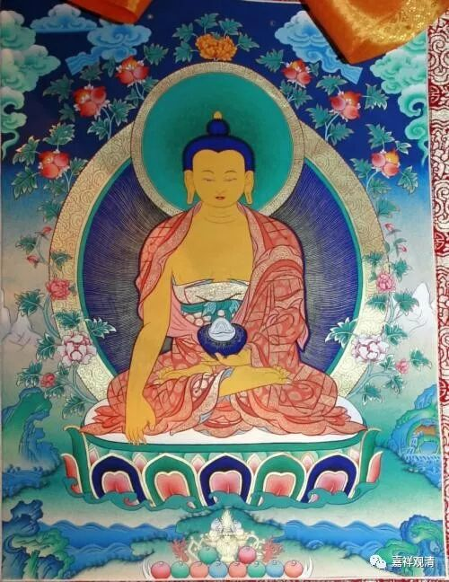

**《菩提速道》024（下）**

所以就是左手持定印，右手触地印。我怎么做都觉得自己要歪过来了，也有可能垫子太高了。还有，大家要知道西藏的唐卡是有一定的度量比例规范的。昨天我去某展览，看了一些别人画的唐卡，一眼看过去就觉得这些唐卡的比例不对。按照规定，两个膝盖之间的距离，和膝盖中间到眉间的距离应该是一样高的。我们在很多唐卡当中看到，膝盖之间的距离基本上是不够的，那整体比例就是不对的。一眼看上去就不对，都不用量了，这肯定不是优秀的画师所画的。后来他们又拿出来一些照片来给我看：“你看，这个照片就是对的。”的确照片上的比例就是对的。

连着在两个展位看到唐卡上的两尊佛像全都不对。主要的原因是他们现在画唐卡根本就不打格子，直接画了，为了节省时间。否则的话，你至少要花半天的时间去打格，然后再描。现在的一些画师不打格子了，直接先画了再说，觉得已经步入了自由阶段了。他们说这叫自由“创作”。其实我懂，有些创作是打破传统的束缚，而有些“创作”只是“不懂规矩”。

其实画唐卡本身的技术性难度不那么高（当然不等于说没有难度，而且，画画这个，有熟能生巧，也有天分啦），因为它也有程式的，比如至少面部、身体在通常“正面照”的情况下应该左右对称啊等等。如果你完全按照那个格式来画的话，左右是肯定对称的。如果你徒手画的话，就可能不对称了，但是出活快了（你懂的），所以现在唐卡的比例失衡等情况是比较严重的。背后当然就是经济这个无形的手在指挥。

以前（单纯仅谈）画唐卡要上色很多次，现在上三次就不错了，从背后往光亮处看过去，可以看到现在很多上色很不均匀。以前（又是“以前”）严格的一天只有上午画，画之前还要念仪轨，顶级的一幅画可能就要花上一两年，连蓝天都是一笔一笔描出来的，而不是出“刷刷刷”刷出来的，金唐（金色的唐卡，其实就是金粉画的）也分得出明暗和细节……现在，都难得见了。现在不仅画得粗糙，甚至还有拿仿真印刷的来冒充（我鉴别不了），乃至有拿印刷的唐卡抹上几笔几万几万卖的（我有兄弟中过招）……人心不古，世风如斯！（甚至这里面还有活佛在干这种骗人的勾当——拿尼泊尔印刷唐卡当真货卖！）

有一个老师父说了一句话：“唉，钱，不是好东西……”他说话时的模样，我至今难忘！

