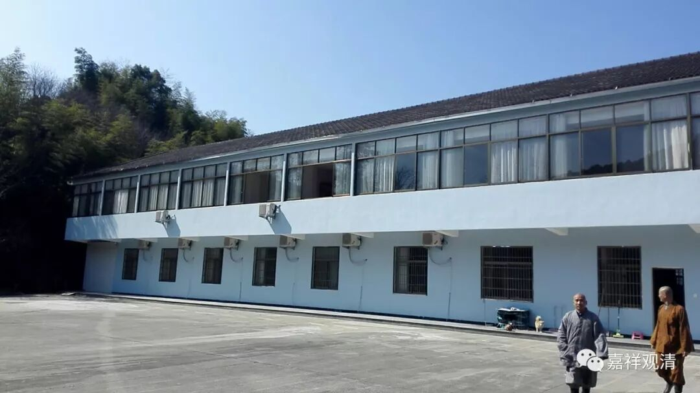
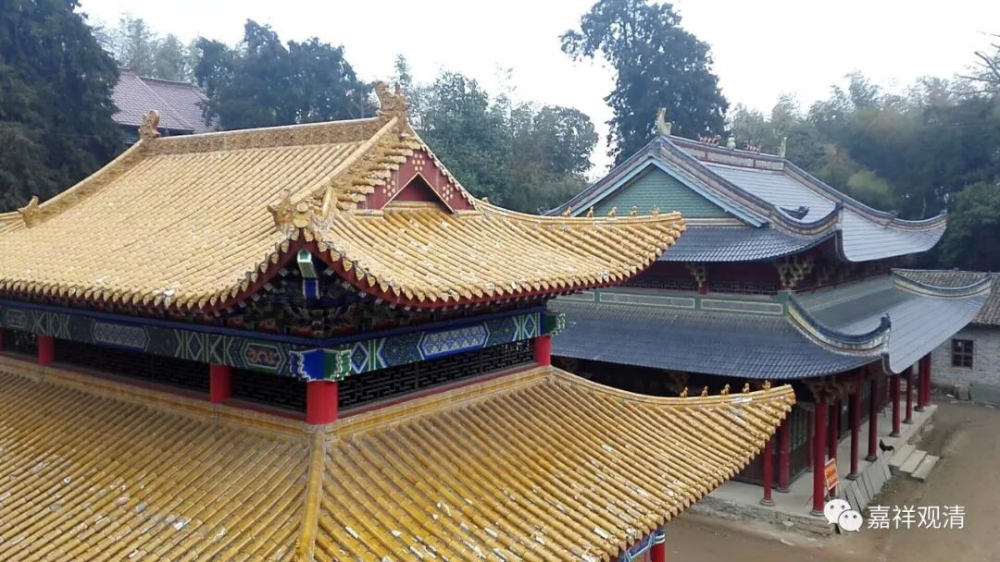
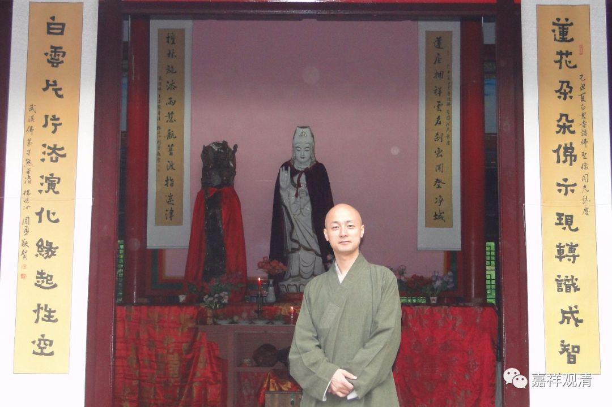
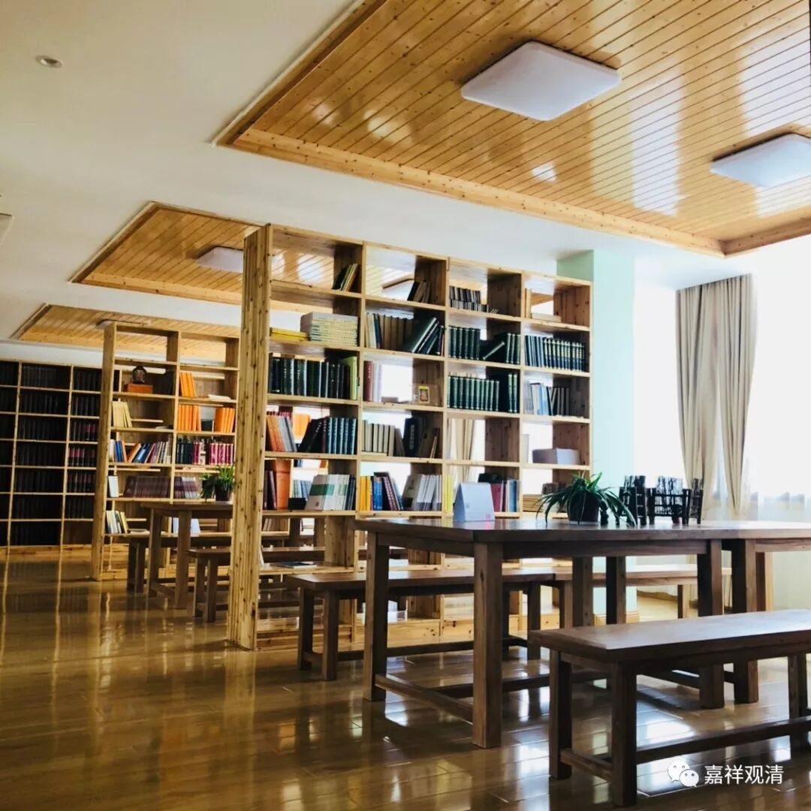

**嘉祥内学院一对一佛学研修招生简章**

** 嘉祥内学院宗旨：**

嘉祥内学院秉承** 支那内学院**遗风，旨在以毗昙、因明、中观、瑜伽、般若为主、藏文、梵文、巴利文为辅，培养佛教义理专门研究人员。每年仅招收一名学生，学制四年，受法师亲炙。

** 主要研修导师**：** 观清法师**

观清法师师承支那内学院王恩洋—唐仲容先生，以及范古农—顾兴根先生、观空法师—本乐老和尚，博学强记，深入佛学义理二十余年，持戒清净，以弘扬三论正法为己任。

** 课程设置：**

第一年：《阿毗达摩集论》、印度佛教史、中国佛教史、藏经版本目录学

第二年：因明基础、《阿含》精读、《入中论》、藏文基础

第三年：《唯识三十颂》、般若基础、《百论》、《十二门论》

第四年：《成唯识论》、《中论》、梵文基础、巴利文基础

在职人员每周四课，晚间授课。

脱产人员每周四课，白天授课，发给适当生活补助。

每月考核，不合格退学。

学习期满，考核合格，可留上海慈慧文化研究所从事佛教研究工作。

** 招生要求：**

1. 人数1-2名。

2. 性别不限。

3. 年龄20—30岁.（特殊情况可适当放宽）

4. 学历为大学本科及以上（含本科在读）。

5. 无任何传染病、精神疾病等，无重大疾病史。

6. 信仰佛教、有志于从事佛教研究工作。

7. 英语6级。（日语、德语优秀者亦可）

** 报名办法：**

将包含学佛经历的个人简历发送至[email protected]

** 本招生简章长期有效，当年招满即止。**

