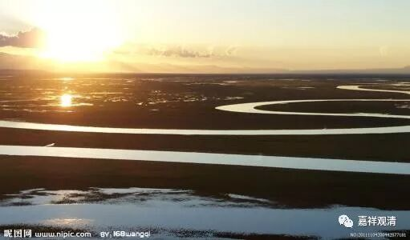
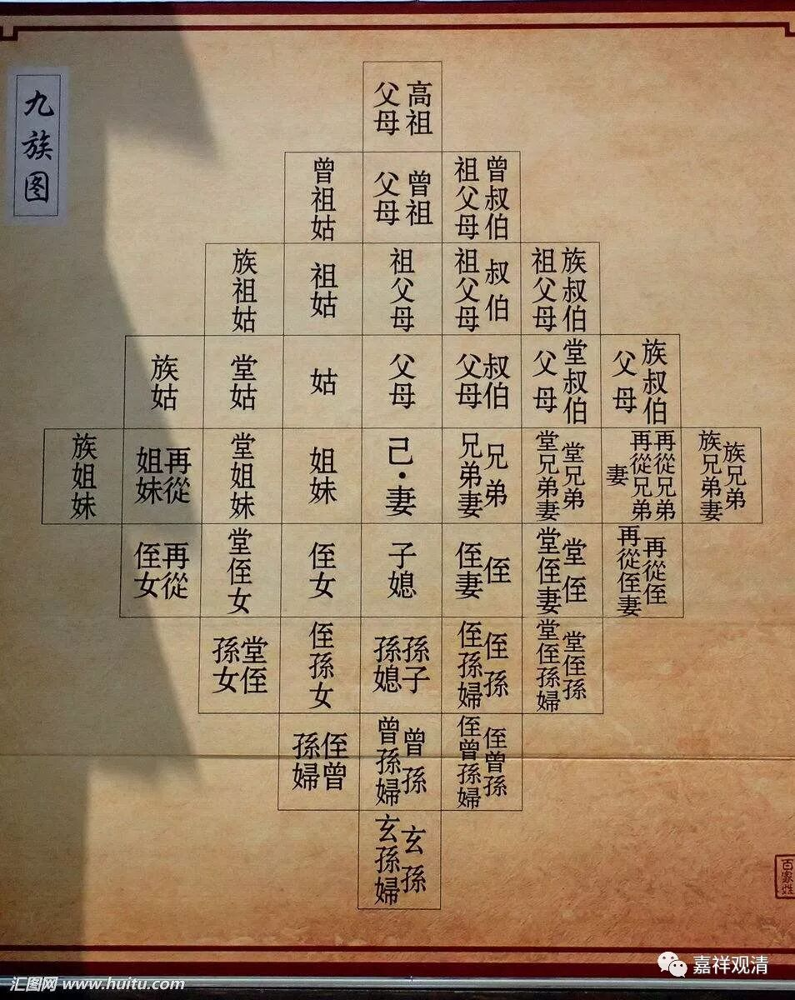

**《菩提速道》025（下）**

** “观想资粮田诸尊对自己熙怡欢喜，”**很高兴地笑了。** “自己也随念诸尊的功德及大悲，”**这个很累啊！“随念诸尊的功德及大悲”，那就要一个个地来。比如说，假如我们要观想的话，就要想哪一尊是谁，然后再想想他的故事，想想他对于圣教的利益：“谢谢你，你太厉害了！而且你本事这么大，请加持我吧！”再想第二个：“哦，你的本事也这么大，加持我吧！”

但是，老实说有好几位祖师是没啥故事的，《道次第师师相承传》当中有个别的故事连一页都不到。那就简单了，想到他，只要一句话：“你很伟大，加持我吧！”我的意思是，我也不知道你的功德，反正我的这么多位师父都说你伟大，那就是你伟大了，这个当然也不能说没有意义吧？道次第里面的有些方面呢，我们没有办法来回答的。

前段时间有人问我：“观清法师，假如佛陀出现在你面前，可以让你问一个问题，你会问什么问题呢？”我说我最想问的是：“释迦佛，到底哪些是你讲的方便法？哪些是解脱法？哪些是教法最核心的部份？哪些只是针对某些人的说法？”我非常想问的是这个问题——“云何方便与解脱？”

传承祖师一代一代，几百个，都要观修……当然既然祖师们都这么说，我也没能力改变说法。首先，我确实没有他们厉害，这点我是有自知之明的，告诉你，也告诉我自己，我确实比班禅大师啊、法王大师啊等等差得多。他们都约定俗成地接受了这些观点，我即使是在实在不能接受的情况下，也只能约定俗成地先接受了再说，虽然我也不知道具体的情况到底怎么样。有些因果的背景到底怎么样，其实我们确实不知道，而他们是不是真的知道，我也不知道。但是传统上既然是这样了，那也就这样了。

其实我心里是想，会不会可以另一种操作：我和我爹亲，知道的事情多一点；爷爷呢，知道的事情就不那么多了（我怀疑过——“他是不是王亚樵的人？”好希望是）；再上面，我基本不知道了，连名字都不知道了，虽然家谱上有——没有他们就没有我，但历代祖先我确实不知道，仅大约知道少昊，知道金日暺，再就不了解了……似乎也没啥问题嘛，连签证官都没问过“你爷爷的爷爷叫啥？”

我们私下曾经开过玩笑，实际上也是这样——既然龙树菩萨和月称菩萨之间只需要这两个人（其实还有很多），那么阿底峡尊者和宗喀巴大师之间，是不是也只需要这两个人呢？宗喀巴大师和我的师父之间，就这么两个人行不行呢？就是少观想一点嘛。要不然，再过两千年的话，那些传承弟子们会累死的。我们已经要观想三百多尊了，到他们那个时候，经过这么多年，当中还不能跳跃的，那得观想多少……其实之前是有跳跃的嘛——龙树菩萨之前是没有的，之后到月称之间也没有祖师接上（我指的是藏传保留的历史），月称菩萨之后也空掉了几百年，直接到小杜鹃……如果我们传承下去也有一千年的话，有时候甚至是每三十年或者十几年就是一代，哇！那时候的弟子要观想三千多尊祖师在面前了！我估计那时候的小和尚要哭了：“师父，你能不能有另外一个办法？我实在是连这些人的名字都记不住。”

上面都算是玩笑话，算是在自留地里吐槽，你们可以当我一句都没说过。（哈哈哈哈）

