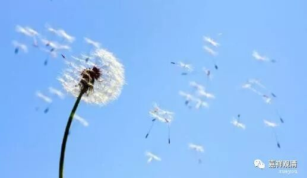

**《菩提速道》027（中）**

就像中国最早在东晋南北朝时期，以道安法师为开创者，形成了类似于僧团的组织模式。那就是，有一批和尚在他周围一起学习，后来人越来越多，就要有一些共同相处的轨范和模式。一开始并没有一定的组织形式，大家各修各的，等开法会讲经，大家集齐了在一起学习。慢慢地，人实在太多，就管不了，比如他还没回来，你又要出去等等。于是就开始设立规矩——大家一起在早晨上殿，念什么经，下午又一起念什么经，或者法会开始的时候要一起念什么经……这样呢，轨范就慢慢地形成了，最初是道安法师制定的。

除了汉族有这样的规矩的制定，印度和西藏也是一样的，宗教仪式化的模式是大家所需要的，也是释迦牟尼佛的教法发展到第三代以后必然出现的产物——这些经就被经忏化了，被仪轨化了，解脱的佛教一变而成宗教化的佛教了。

我还是敢这么说——这个就是佛教的方便法，这些宗教仪式本身肯定是佛教的方便法，是因为大家需要。方便法本身没有错，但是大家一定要知道，方便法不是究竟法，不要方便了以后就把自己也方便进去了。没有解脱法的方便法，可能连佛法都不是。（这里说的“方便法”，并不是和“般若”搭伙的“方便”的那个意思。）

你看，佛教历史就是这样的，在经过了几百年或者千年的“方便”之后，就会出现一个新的人物对它进行改革，或者再改回去。比如说，佛教经过几百年的发展以后，就出现了龙树菩萨这样的人物，在他的后面，还有无著菩萨、世亲菩萨来跟上，再经过几百年呢，又有了阿底峡尊者，之后又有了宗大师这样的人物，就这样几百年、几百年地跟上、整理、扬弃……对他们时代的“教法”，他们既要做加法，也要做减法。但是这些世间的利益，从某种角度上他们也不敢得罪的，因为这个实在是太强大了。我认识一个住持，因为不做经忏，晚上被庙里的和尚把菜刀架到脖子上了——第二天他就逃走了……

我刚到白云寺把那些签烧掉的时候，下面的老百姓都快疯了，他们跑到山上来说：“你把观音菩萨关起来了！不让观音菩萨跟我们沟通了！！”他们本来就不是要抽签，他们的抽签就等于是向观音菩萨问卦，现在观音签被我烧掉了，他们问不到了，就等于是我把观音菩萨关起来了，所以我就是“坏和尚”。

后来趁我不在寺院的时候，他们又私下恢复了，自己动手做的。山里面的人，手都很巧，挖了一个竹根，用刀削一削，然后告子就有了。他们山里人真的手很巧。比如说，上山的时候他没有带筷子，马上砍两根竹子，自己一削就有了两根筷子……这样，他们又找回了观音菩萨。

