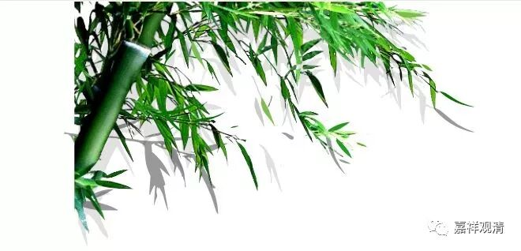

**《菩提速道》027（下）**

像我们这些人到山里闭关肯定要死掉的，啥事都不会做。我们闭关就需要很多圆满的条件，所以最后不得不说我们是大乘，我们需要很多的福报，实际上是因为我们很多基本的事情都做不来。我碰到过有些和尚，那真的是能力很强啊！“山上的这个东西可以吃的，那个东西可以做豆腐的。”他想吃的时候，还会自己磨豆腐。其实我们有时候苦修，并不是因为我们真的能苦修，是因为我们其他事都不会做，只能苦修。就像有些会做事的人，就会把自己的生活调理得很好，是吧？

** “此时的所缘者，观上师能仁及其周围有直接或间接法缘的传承上师身分中降下五彩光明甘露，”**这个就是师父这样放光，直接降下五彩光明甘露。总的来说是五彩光明甘露，你也可以把它理解为每一种色彩有不同的意义，是吧？你们知道“息增怀伏”的话，就知道白颜色或者透明的光是息除障碍的，黄颜色是增长我们的善业和好的地方，蓝颜色可以想象为药师佛的光，消除我们的病障和各种罪障的，红颜色，黑颜色……

文字上是光明甘露，它既是甘露，又是光明。它是像光一样的甘露，像甘露一样的光，类似“波粒二象性”，也可以这么说。从自己角度看过去，它的意义就是甘露，从另外一个角度看上去，它就是光，所以说是像光一样的甘露，像甘露一样的光。说是五彩，红白黄蓝黑，黑颜色实际上讲的是深蓝色，意思是息增怀伏的降伏，是象征意义。

** “注入自他一切有情身心之中，”**放光，注入自己的身心当中，同时也注入周围有情的身心当中，就是降甘露。

降甘露有两种方式，这一种就是从我们的身体里面降甘露下去，好像我们的身体里面是空的一样，或者说像一个装满的容器，这个身体里面就像一个空壳子，然后光进入到这里面，再慢慢地把自己里面不好的东西和所有的障碍都变成黑水从身体下面流出去。还有一种降甘露的方式呢，是观想甘露光明降下来，从全身的表面流下去。

