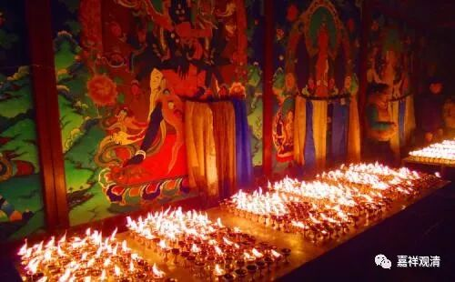

**《菩提速道》028（中）**

** “净化无始以来积聚的一切罪障，尤其损伤吉祥上师的法体、违背上师的教言、扰乱上师的心意，以及不信、凌辱、讥毁等，总之一切依于上师而产生的罪障，犹如烟汁、墨汁一般，从所有根门及毛孔中排出，自身变得清净莹洁。譬如附着于陡峭崖壁上的热灰，用水一冲就冲掉了。又好像手持明灯进入暗室，黑暗自然会消失于无形。这两种比喻，温萨巴大师以为后者的力量更大一些。如是一切依于上师的罪障皆得以清净，一切寿命福德及教证功德皆得以增长，特别是上师身语意的一切加持进入自他一切有情身心之中，自他一切有情都进入到上师的庇护之下。”**

** **

这一段是依止善知识的部分，先要净罪——以前所有的不对，这些罪障是什么呢？是在对待善知识方面的不对，要把这方面的障碍全部消除。比如说我们在修止观的时候也一样，呼出去的不好的东西是什么呢？是我们在修止观方面的障碍。所以，你修什么的时候呢，就是对应的障碍被消除。这里要消除的是在依止师长方面的错误。

后面讲到的其他地方也都差不多是这个意思，这一类的内容你只要搞清楚一个，其他的其实都差不多。每次都做类似的观想，每次要消除的都是自己所要修习的相应的障碍，那么反过来就是，相应地证得。比如说在修“皈依”是就是皈依方面的障碍消除，在修业果是就是业果取舍方面的障碍消除……等等

** “这样思惟以后，随力念诵‘皈依佛’若干遍。这时心中的所缘者，观想金刚持佛及其周围环绕的密集、胜乐、大威德三尊，以及喜金刚、时轮金刚、贤劫千佛、三十五佛等，诸尊身分中降下五彩光明甘露，注入自他一切有情身心之中，由此无始以来所积的一切罪障，尤其是恶心出佛身血、毁坏意所依——佛塔等，总之一切违背皈依佛之后皈依学处的所有罪障皆得以清净，自身变为莹澈的光明之体，”**

** **

就是所有的障碍全都排除了，自己变成水晶一样，或者器皿当中全都是甘露。你可以多观想几次，越来越干净，越来越干净，最后变成完全都是甘露光。

** “一切寿命福德及教证功德皆得以增长，”**好处也都得到了。** “特别是佛身语意的一切加持进入自他一切有情身心之中，自他一切有情都进入到佛的庇护之下。”**

仔细来讲的话，也可以分成两个部分：一个部分是消除障碍，一个部分是获得加持，对吧？你要分成两个也可以：一个是除障，之后一个是加持。你要合成一个也可以：就是在消除障碍的时同获得加持。

