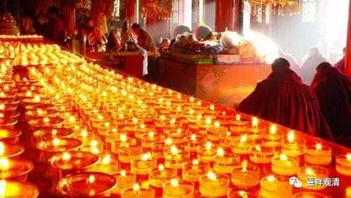

**年度供僧祈福活动**

每年我们都会有的积资净障活动——拉卜楞寺供僧、供养全体僧人讽诵大藏经（《甘珠尔》）以及十三个千供、大威德息增怀伏火供……的活动又要开始了。今年是我们（比较正式）的第四届了吧……

十三个千供，照顾了各方面的功能，包括文殊千供、度母千供、宗喀巴千供、十一面观音千供大、白伞盖千供、长寿佛千供、药师佛千供……包含了智慧、健康、长寿、除障等各方便的祈愿。

大威德息、增、怀、伏火供的意义与上大致相同。

讽诵大藏经（《甘珠尔》）一般是中大型的寺院每年举行的活动，一般一年一次（数百人的中型寺院）或三四次（千人以上的大型寺院），一般安排在上半年重要的节日，由于很少进行，法会也偏大，故一般很早甚至数年前功德主就订好日期和准备了。我们则常年在拉寺都预订了这样的一次法会，一般会安排在藏历三月初。

每年这个活动是由大家随喜发心，款项我统一交付拉寺专人负责法会供僧等事宜（这样的大型活动当天需要至少三四十人来帮忙）。

另外，基于参与“积资净障活动”越多越好的目的，若稍富足，我们也会将少量款项供养其他寺院的供僧等活动——这也已经是我们的一贯做法了。

从今天开始，到4月16号（三月初一）截止，大家随喜功德的可以直接微信或者支付宝转给我，银行转帐也可以。任何人任何形式的转账、打款都请把金额和姓名发给我，以我能知道的方式（不接受托梦传递信息）。账号分别如下：

微信：shiguanqing1973

支付宝：[email protected]

银行：中国银行上海市黄金城道支行：6217860800002238034

注：本次活动属于内部活动，不勉强任何人参加。

