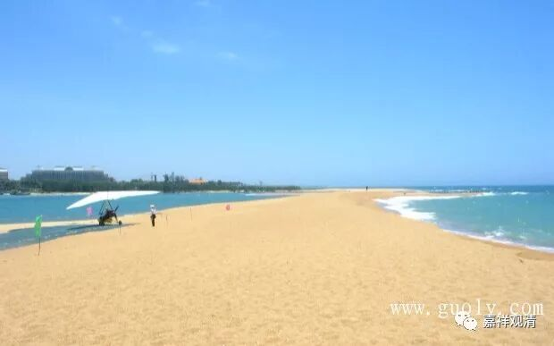

**《“四生说”在佛教历史上的承许和演变》**

** （一）**

据玄奘译《异部宗轮论》，谓大众部系统许有法从自生、他生、共生者，勘《部执异论》，此唯大众部本宗所许，其“少法”由自生等者，《部执异论》谓“少苦”。而有部《大毗婆沙论》引《阿含》，亦以为“不自生”、“不他生”、“不共生”都有点解释的矛盾，故实际亦暗许“有法自生”等。

《大毗婆沙论》谓语出《无衣迦叶波经》，无衣，即耆那教，佛典常称为裸形外道。无衣迦叶波，即耆那教外道迦叶波。

勘《杂阿含经·外道出家相应》有“尸婆外道”篇与此相似，“尸婆外道”，《南传相应部》谓“游行者髻发尸婆迦”，《弥兰王问经》谓出自《杂阿含经（相应部）·最胜解说经》的外道名为“莫里雅希瓦卡”或“希瓦卡”，此三处文自相似，外道名亦勘同。虽未明说“尸婆外道”为耆那教裸形外道，而其所述之义便是耆那教的“业灭得解脱”的理论，故可断为即耆那教的僧侣。

《杂阿含经·外道出家相应》谓：

“……尔时、尸婆外道出家，来诣佛所，与世尊面相问讯，慰劳已，退坐一面。白佛言：“瞿昙！有一沙门、婆罗门，作如是见、如是说：若人有所知觉，彼一切本所作因；修诸苦行，令过去业尽，更不造新业。断于因缘，于未来世无复诸漏，诸漏尽故业尽，业尽故苦尽，苦尽者究竟苦边。今瞿昙所说云何”？

佛告尸婆：“彼沙门、婆罗门，实尔洛漠说耳！不审、不数，愚痴、不善、不辩……”

此说外道尸婆问佛：“有人说，‘业尽故苦尽’，故修苦行，断尽诸业，则得解脱。是不是这样？”

佛陀的回答是否定的：不是一切业尽则苦尽。

若依《南传相应部》、《弥兰王问经》等，则此处还有一个意思要表达和讨论的——“是不是一切法都是前业所生”？！佛陀的意思显然是否定的……

