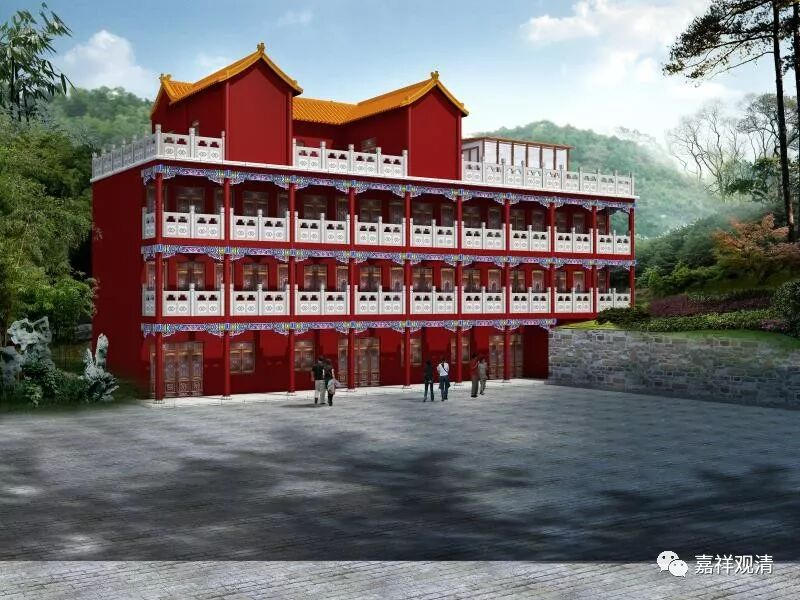

**莲花山白云寺僧寮改建工程缘启**

斯恰逢二月初八，释迦世尊出家纪念日。

莲花山白云寺现正改建原僧寮，古建之乡大冶来的古建工程队也已经到位，现已搭完脚手架，将对僧寮进行加层和内外防水、内外装修部分，木匠也在打制衣橱、书橱等学僧家具。

曰道由人弘，身安则道隆。白云寺僧寮此次改造也是为了给阖寺僧众以更好的生活和学习环境。

欢迎大家随喜捐助，可以扫下面的二维码。在此，谨随喜诸位善信功德。

也可以加我微信单独转款给我，或者可以通过支付宝和银行转帐，也都可以。支付宝和转账请注明随喜白云寺僧寮改建工程。谢谢大家！

莲花山白云寺住持

释观清

微信：shiguanqing1973

支付宝：[email protected]

银行：中国银行上海市黄金城道支行：6217860800002238034

（大致算个学问僧，诸不善言辞之处……请诸位见谅。）

以下是几个设计稿。

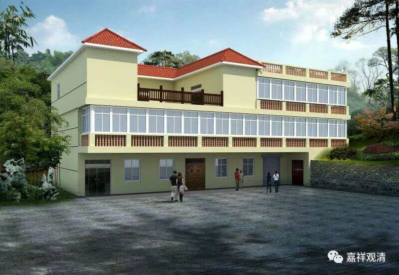

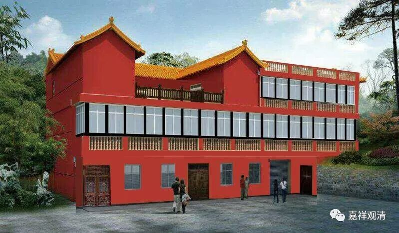

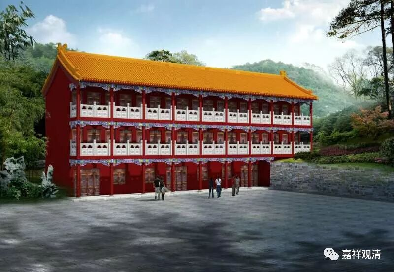

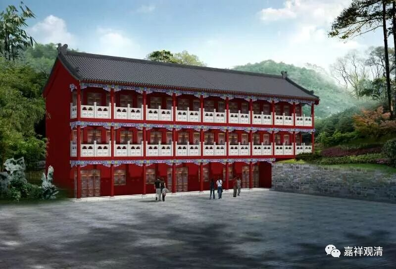

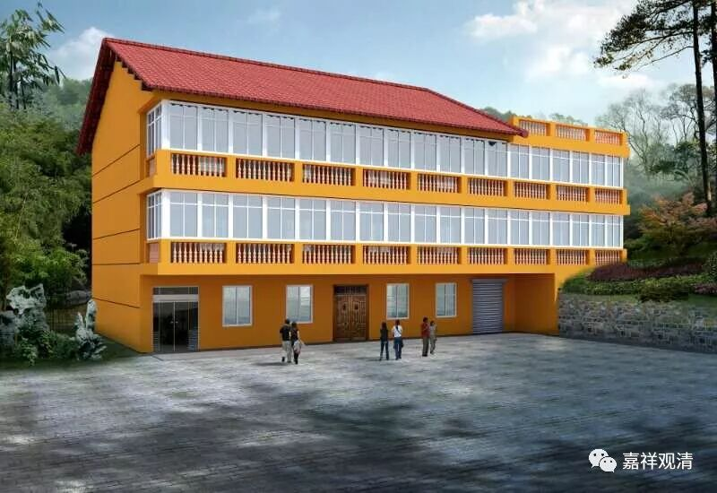

设计手稿

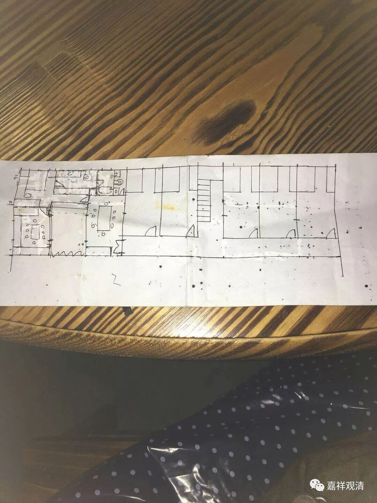

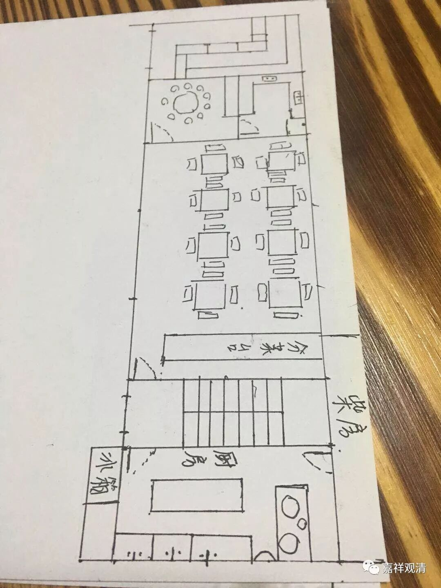

脚手架

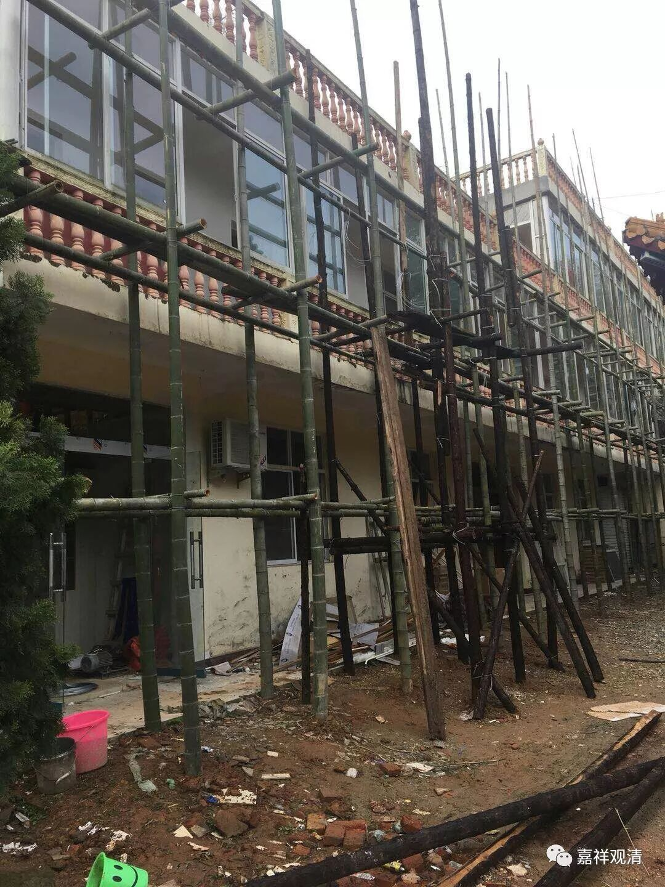

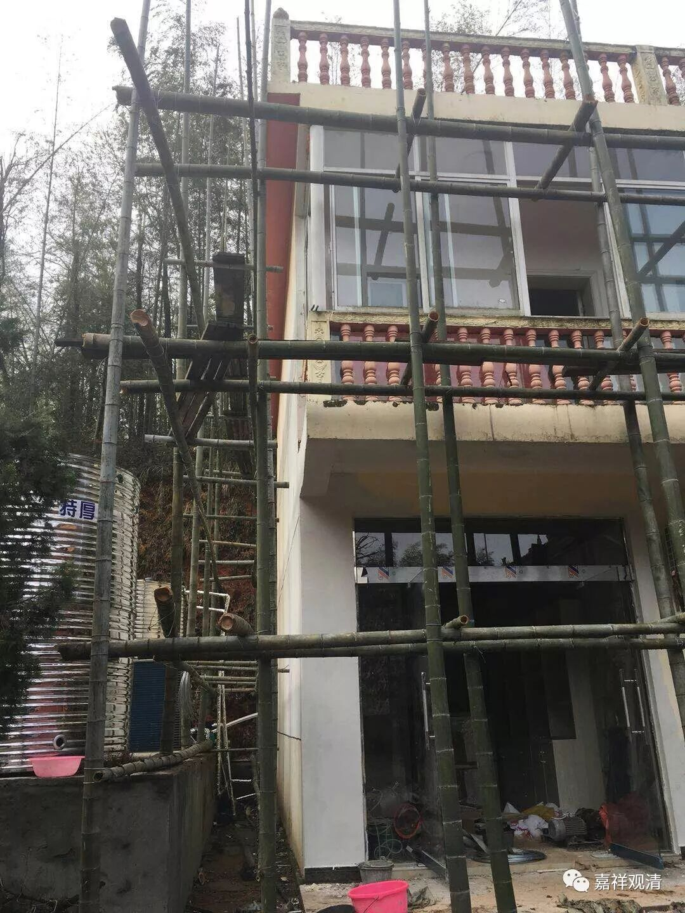

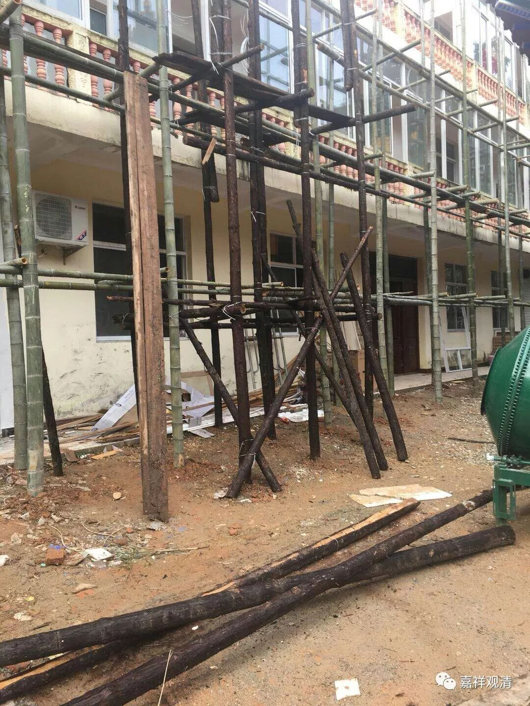

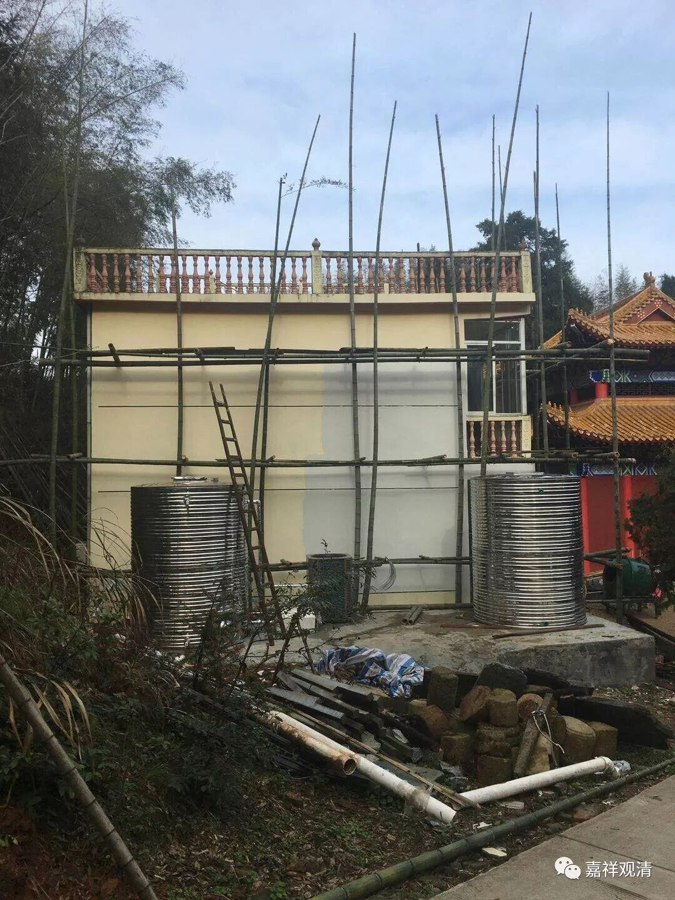

书橱和衣橱等木工活儿

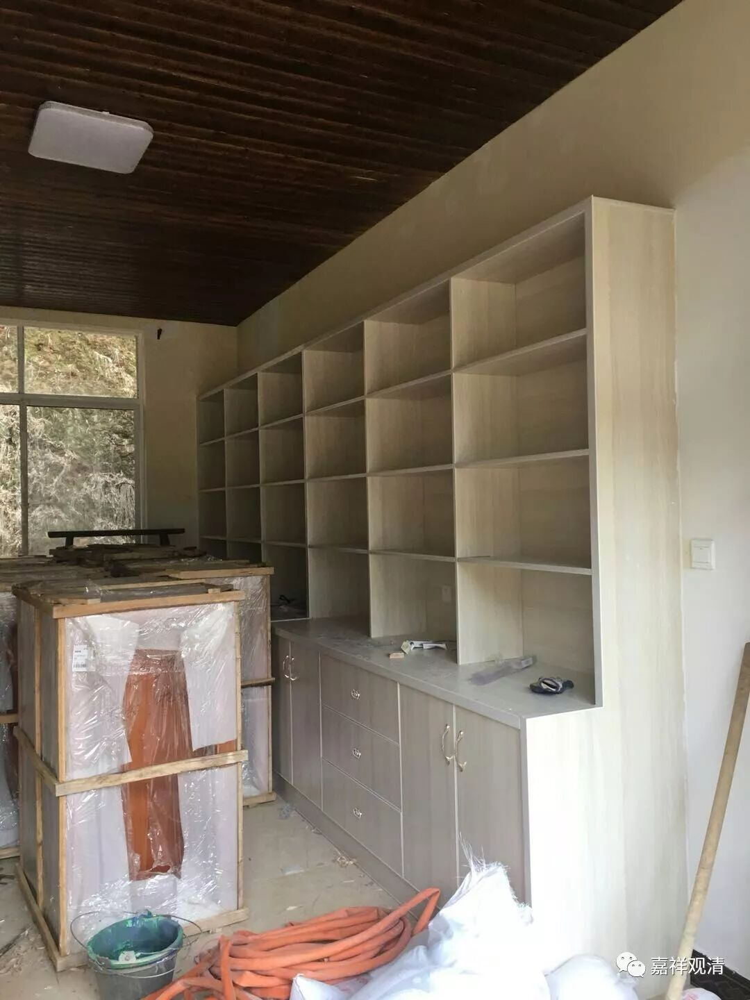

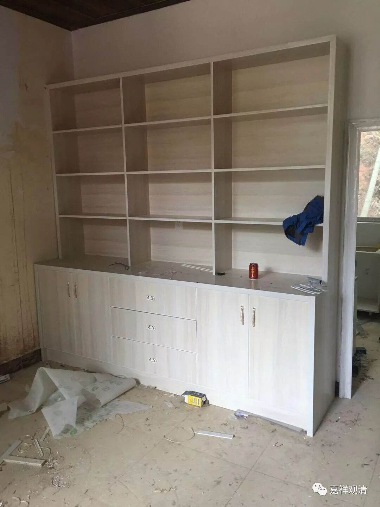

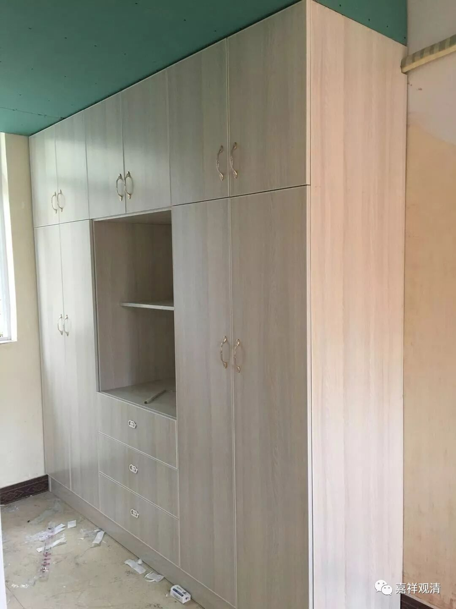

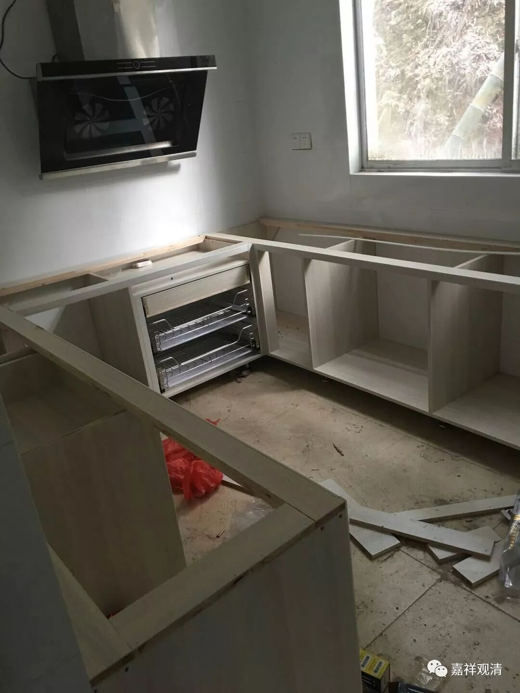

